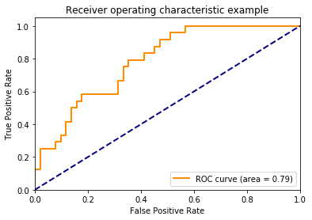
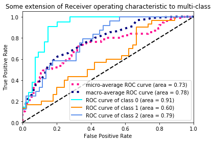
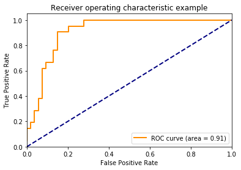
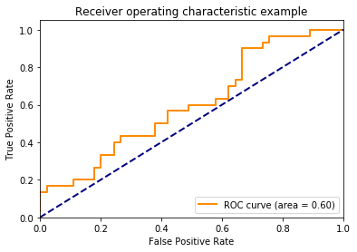

# auc_roc

```python
%matplotlib inline
```
=======================================
Receiver Operating Characteristic (ROC)
=======================================

Example of Receiver Operating Characteristic (ROC) metric to evaluate
classifier output quality.

ROC curves typically feature true positive rate on the Y axis, and false
positive rate on the X axis. This means that the top left corner of the plot is
the "ideal" point - a false positive rate of zero, and a true positive rate of
one. This is not very realistic, but it does mean that a larger area under the
curve (AUC) is usually better.

The "steepness" of ROC curves is also important, since it is ideal to maximize
the true positive rate while minimizing the false positive rate.

Multiclass settings
-------------------

ROC curves are typically used in binary classification to study the output of
a classifier. In order to extend ROC curve and ROC area to multi-class
or multi-label classification, it is necessary to binarize the output. One ROC
curve can be drawn per label, but one can also draw a ROC curve by considering
each element of the label indicator matrix as a binary prediction
(micro-averaging).

Another evaluation measure for multi-class classification is
macro-averaging, which gives equal weight to the classification of each
label.

<div class="alert alert-info"><h4>Note</h4><p>See also :func:`sklearn.metrics.roc_auc_score`,
             `sphx_glr_auto_examples_model_selection_plot_roc_crossval.py`.</p></div>


```python
print(__doc__)

import numpy as np
import matplotlib.pyplot as plt
from itertools import cycle

from sklearn import svm, datasets
from sklearn.metrics import roc_curve, auc
from sklearn.model_selection import train_test_split
from sklearn.preprocessing import label_binarize
from sklearn.multiclass import OneVsRestClassifier
from scipy import interp

# Import some data to play with
iris = datasets.load_iris()
X = iris.data
y = iris.target

# Binarize the output
y = label_binarize(y, classes=[0, 1, 2])
n_classes = y.shape[1]

# Add noisy features to make the problem harder
random_state = np.random.RandomState(0)
n_samples, n_features = X.shape
X = np.c_[X, random_state.randn(n_samples, 200 * n_features)]

# shuffle and split training and test sets
X_train, X_test, y_train, y_test = train_test_split(X, y, test_size=.5,
                                                    random_state=0)

# Learn to predict each class against the other
classifier = OneVsRestClassifier(svm.SVC(kernel='linear', probability=True,
                                 random_state=random_state))
y_score = classifier.fit(X_train, y_train).decision_function(X_test)

# Compute ROC curve and ROC area for each class
fpr = dict()
tpr = dict()
roc_auc = dict()
for i in range(n_classes):
    fpr[i], tpr[i], _ = roc_curve(y_test[:, i], y_score[:, i])
    roc_auc[i] = auc(fpr[i], tpr[i])

# Compute micro-average ROC curve and ROC area
fpr["micro"], tpr["micro"], _ = roc_curve(y_test.ravel(), y_score.ravel())
roc_auc["micro"] = auc(fpr["micro"], tpr["micro"])

```
**Plot of a ROC curve for a specific class**
```python
plt.figure()
lw = 2
plt.plot(fpr[2], tpr[2], color='darkorange',
         lw=lw, label='ROC curve (area = %0.2f)' % roc_auc[2])
plt.plot([0, 1], [0, 1], color='navy', lw=lw, linestyle='--')
plt.xlim([0.0, 1.0])
plt.ylim([0.0, 1.05])
plt.xlabel('False Positive Rate')
plt.ylabel('True Positive Rate')
plt.title('Receiver operating characteristic example')
plt.legend(loc="lower right")
plt.show()
```

**Plot ROC curves for the multiclass problem**

```python
# Compute macro-average ROC curve and ROC area

# First aggregate all false positive rates
all_fpr = np.unique(np.concatenate([fpr[i] for i in range(n_classes)]))

# Then interpolate all ROC curves at this points
mean_tpr = np.zeros_like(all_fpr)
for i in range(n_classes):
    mean_tpr += interp(all_fpr, fpr[i], tpr[i])

# Finally average it and compute AUC
mean_tpr /= n_classes

fpr["macro"] = all_fpr
tpr["macro"] = mean_tpr
roc_auc["macro"] = auc(fpr["macro"], tpr["macro"])

# Plot all ROC curves
plt.figure()
plt.plot(fpr["micro"], tpr["micro"],
         label='micro-average ROC curve (area = {0:0.2f})'
               ''.format(roc_auc["micro"]),
         color='deeppink', linestyle=':', linewidth=4)

plt.plot(fpr["macro"], tpr["macro"],
         label='macro-average ROC curve (area = {0:0.2f})'
               ''.format(roc_auc["macro"]),
         color='navy', linestyle=':', linewidth=4)

colors = cycle(['aqua', 'darkorange', 'cornflowerblue'])
for i, color in zip(range(n_classes), colors):
    plt.plot(fpr[i], tpr[i], color=color, lw=lw,
             label='ROC curve of class {0} (area = {1:0.2f})'
             ''.format(i, roc_auc[i]))

plt.plot([0, 1], [0, 1], 'k--', lw=lw)
plt.xlim([0.0, 1.0])
plt.ylim([0.0, 1.05])
plt.xlabel('False Positive Rate')
plt.ylabel('True Positive Rate')
plt.title('Some extension of Receiver operating characteristic to multi-class')
plt.legend(loc="lower right")
plt.show()

```


**Import some data to play with**
```python
print(__doc__)

import numpy as np
import matplotlib.pyplot as plt
from itertools import cycle

from sklearn import svm, datasets
from sklearn.metrics import roc_curve, auc
from sklearn.model_selection import train_test_split
from sklearn.preprocessing import label_binarize
from sklearn.multiclass import OneVsRestClassifier
from scipy import interp

# Import some data to play with
iris = datasets.load_iris()
X = iris.data
y = iris.target

print(X)
print(y)
```
```
Automatically created module for IPython interactive environment
[[5.1 3.5 1.4 0.2]
 [4.9 3.  1.4 0.2]
 [4.7 3.2 1.3 0.2]
 [4.6 3.1 1.5 0.2]
 [5.  3.6 1.4 0.2]
 [5.4 3.9 1.7 0.4]
 [4.6 3.4 1.4 0.3]
 [5.  3.4 1.5 0.2]
 [4.4 2.9 1.4 0.2]
 [4.9 3.1 1.5 0.1]
 [5.4 3.7 1.5 0.2]
 [4.8 3.4 1.6 0.2]
 [4.8 3.  1.4 0.1]
 [4.3 3.  1.1 0.1]
 [5.8 4.  1.2 0.2]
 [5.7 4.4 1.5 0.4]
 [5.4 3.9 1.3 0.4]
 [5.1 3.5 1.4 0.3]
 [5.7 3.8 1.7 0.3]
 [5.1 3.8 1.5 0.3]
 [5.4 3.4 1.7 0.2]
 [5.1 3.7 1.5 0.4]
 [4.6 3.6 1.  0.2]
 [5.1 3.3 1.7 0.5]
 [4.8 3.4 1.9 0.2]
 [5.  3.  1.6 0.2]
 [5.  3.4 1.6 0.4]
 [5.2 3.5 1.5 0.2]
 [5.2 3.4 1.4 0.2]
 [4.7 3.2 1.6 0.2]
 [4.8 3.1 1.6 0.2]
 [5.4 3.4 1.5 0.4]
 [5.2 4.1 1.5 0.1]
 [5.5 4.2 1.4 0.2]
 [4.9 3.1 1.5 0.1]
 [5.  3.2 1.2 0.2]
 [5.5 3.5 1.3 0.2]
 [4.9 3.1 1.5 0.1]
 [4.4 3.  1.3 0.2]
 [5.1 3.4 1.5 0.2]
 [5.  3.5 1.3 0.3]
 [4.5 2.3 1.3 0.3]
 [4.4 3.2 1.3 0.2]
 [5.  3.5 1.6 0.6]
 [5.1 3.8 1.9 0.4]
 [4.8 3.  1.4 0.3]
 [5.1 3.8 1.6 0.2]
 [4.6 3.2 1.4 0.2]
 [5.3 3.7 1.5 0.2]
 [5.  3.3 1.4 0.2]
 [7.  3.2 4.7 1.4]
 [6.4 3.2 4.5 1.5]
 [6.9 3.1 4.9 1.5]
 [5.5 2.3 4.  1.3]
 [6.5 2.8 4.6 1.5]
 [5.7 2.8 4.5 1.3]
 [6.3 3.3 4.7 1.6]
 [4.9 2.4 3.3 1. ]
 [6.6 2.9 4.6 1.3]
 [5.2 2.7 3.9 1.4]
 [5.  2.  3.5 1. ]
 [5.9 3.  4.2 1.5]
 [6.  2.2 4.  1. ]
 [6.1 2.9 4.7 1.4]
 [5.6 2.9 3.6 1.3]
 [6.7 3.1 4.4 1.4]
 [5.6 3.  4.5 1.5]
 [5.8 2.7 4.1 1. ]
 [6.2 2.2 4.5 1.5]
 [5.6 2.5 3.9 1.1]
 [5.9 3.2 4.8 1.8]
 [6.1 2.8 4.  1.3]
 [6.3 2.5 4.9 1.5]
 [6.1 2.8 4.7 1.2]
 [6.4 2.9 4.3 1.3]
 [6.6 3.  4.4 1.4]
 [6.8 2.8 4.8 1.4]
 [6.7 3.  5.  1.7]
 [6.  2.9 4.5 1.5]
 [5.7 2.6 3.5 1. ]
 [5.5 2.4 3.8 1.1]
 [5.5 2.4 3.7 1. ]
 [5.8 2.7 3.9 1.2]
 [6.  2.7 5.1 1.6]
 [5.4 3.  4.5 1.5]
 [6.  3.4 4.5 1.6]
 [6.7 3.1 4.7 1.5]
 [6.3 2.3 4.4 1.3]
 [5.6 3.  4.1 1.3]
 [5.5 2.5 4.  1.3]
 [5.5 2.6 4.4 1.2]
 [6.1 3.  4.6 1.4]
 [5.8 2.6 4.  1.2]
 [5.  2.3 3.3 1. ]
 [5.6 2.7 4.2 1.3]
 [5.7 3.  4.2 1.2]
 [5.7 2.9 4.2 1.3]
 [6.2 2.9 4.3 1.3]
 [5.1 2.5 3.  1.1]
 [5.7 2.8 4.1 1.3]
 [6.3 3.3 6.  2.5]
 [5.8 2.7 5.1 1.9]
 [7.1 3.  5.9 2.1]
 [6.3 2.9 5.6 1.8]
 [6.5 3.  5.8 2.2]
 [7.6 3.  6.6 2.1]
 [4.9 2.5 4.5 1.7]
 [7.3 2.9 6.3 1.8]
 [6.7 2.5 5.8 1.8]
 [7.2 3.6 6.1 2.5]
 [6.5 3.2 5.1 2. ]
 [6.4 2.7 5.3 1.9]
 [6.8 3.  5.5 2.1]
 [5.7 2.5 5.  2. ]
 [5.8 2.8 5.1 2.4]
 [6.4 3.2 5.3 2.3]
 [6.5 3.  5.5 1.8]
 [7.7 3.8 6.7 2.2]
 [7.7 2.6 6.9 2.3]
 [6.  2.2 5.  1.5]
 [6.9 3.2 5.7 2.3]
 [5.6 2.8 4.9 2. ]
 [7.7 2.8 6.7 2. ]
 [6.3 2.7 4.9 1.8]
 [6.7 3.3 5.7 2.1]
 [7.2 3.2 6.  1.8]
 [6.2 2.8 4.8 1.8]
 [6.1 3.  4.9 1.8]
 [6.4 2.8 5.6 2.1]
 [7.2 3.  5.8 1.6]
 [7.4 2.8 6.1 1.9]
 [7.9 3.8 6.4 2. ]
 [6.4 2.8 5.6 2.2]
 [6.3 2.8 5.1 1.5]
 [6.1 2.6 5.6 1.4]
 [7.7 3.  6.1 2.3]
 [6.3 3.4 5.6 2.4]
 [6.4 3.1 5.5 1.8]
 [6.  3.  4.8 1.8]
 [6.9 3.1 5.4 2.1]
 [6.7 3.1 5.6 2.4]
 [6.9 3.1 5.1 2.3]
 [5.8 2.7 5.1 1.9]
 [6.8 3.2 5.9 2.3]
 [6.7 3.3 5.7 2.5]
 [6.7 3.  5.2 2.3]
 [6.3 2.5 5.  1.9]
 [6.5 3.  5.2 2. ]
 [6.2 3.4 5.4 2.3]
 [5.9 3.  5.1 1.8]]
[0 0 0 0 0 0 0 0 0 0 0 0 0 0 0 0 0 0 0 0 0 0 0 0 0 0 0 0 0 0 0 0 0 0 0 0 0
 0 0 0 0 0 0 0 0 0 0 0 0 0 1 1 1 1 1 1 1 1 1 1 1 1 1 1 1 1 1 1 1 1 1 1 1 1
 1 1 1 1 1 1 1 1 1 1 1 1 1 1 1 1 1 1 1 1 1 1 1 1 1 1 2 2 2 2 2 2 2 2 2 2 2
 2 2 2 2 2 2 2 2 2 2 2 2 2 2 2 2 2 2 2 2 2 2 2 2 2 2 2 2 2 2 2 2 2 2 2 2 2
 2 2]
 ```
```python
# Binarize the output
y = label_binarize(y, classes=[0, 1, 2])
n_classes = y.shape[1]

print(y)
print(n_classes)
print(y.shape[0])
```
```
[[1 0 0]
 [1 0 0]
 [1 0 0]
 [1 0 0]
 [1 0 0]
 [1 0 0]
 [1 0 0]
 [1 0 0]
 [1 0 0]
 [1 0 0]
 [1 0 0]
 [1 0 0]
 [1 0 0]
 [1 0 0]
 [1 0 0]
 [1 0 0]
 [1 0 0]
 [1 0 0]
 [1 0 0]
 [1 0 0]
 [1 0 0]
 [1 0 0]
 [1 0 0]
 [1 0 0]
 [1 0 0]
 [1 0 0]
 [1 0 0]
 [1 0 0]
 [1 0 0]
 [1 0 0]
 [1 0 0]
 [1 0 0]
 [1 0 0]
 [1 0 0]
 [1 0 0]
 [1 0 0]
 [1 0 0]
 [1 0 0]
 [1 0 0]
 [1 0 0]
 [1 0 0]
 [1 0 0]
 [1 0 0]
 [1 0 0]
 [1 0 0]
 [1 0 0]
 [1 0 0]
 [1 0 0]
 [1 0 0]
 [1 0 0]
 [0 1 0]
 [0 1 0]
 [0 1 0]
 [0 1 0]
 [0 1 0]
 [0 1 0]
 [0 1 0]
 [0 1 0]
 [0 1 0]
 [0 1 0]
 [0 1 0]
 [0 1 0]
 [0 1 0]
 [0 1 0]
 [0 1 0]
 [0 1 0]
 [0 1 0]
 [0 1 0]
 [0 1 0]
 [0 1 0]
 [0 1 0]
 [0 1 0]
 [0 1 0]
 [0 1 0]
 [0 1 0]
 [0 1 0]
 [0 1 0]
 [0 1 0]
 [0 1 0]
 [0 1 0]
 [0 1 0]
 [0 1 0]
 [0 1 0]
 [0 1 0]
 [0 1 0]
 [0 1 0]
 [0 1 0]
 [0 1 0]
 [0 1 0]
 [0 1 0]
 [0 1 0]
 [0 1 0]
 [0 1 0]
 [0 1 0]
 [0 1 0]
 [0 1 0]
 [0 1 0]
 [0 1 0]
 [0 1 0]
 [0 1 0]
 [0 0 1]
 [0 0 1]
 [0 0 1]
 [0 0 1]
 [0 0 1]
 [0 0 1]
 [0 0 1]
 [0 0 1]
 [0 0 1]
 [0 0 1]
 [0 0 1]
 [0 0 1]
 [0 0 1]
 [0 0 1]
 [0 0 1]
 [0 0 1]
 [0 0 1]
 [0 0 1]
 [0 0 1]
 [0 0 1]
 [0 0 1]
 [0 0 1]
 [0 0 1]
 [0 0 1]
 [0 0 1]
 [0 0 1]
 [0 0 1]
 [0 0 1]
 [0 0 1]
 [0 0 1]
 [0 0 1]
 [0 0 1]
 [0 0 1]
 [0 0 1]
 [0 0 1]
 [0 0 1]
 [0 0 1]
 [0 0 1]
 [0 0 1]
 [0 0 1]
 [0 0 1]
 [0 0 1]
 [0 0 1]
 [0 0 1]
 [0 0 1]
 [0 0 1]
 [0 0 1]
 [0 0 1]
 [0 0 1]
 [0 0 1]]
3
150
```
**Add noisy features to make the problem harder**
```python
# Add noisy features to make the problem harder
random_state = np.random.RandomState(0)
n_samples, n_features = X.shape
X2 = np.c_[X, random_state.randn(n_samples, 200 * n_features)]


print(random_state)
print(n_samples, n_features)
print(X.shape)
print(X)
print(X2.shape)
print(X2)
```
```
<mtrand.RandomState object at 0x7f3199801870>
150 4
(150, 4)
[[5.1 3.5 1.4 0.2]
 [4.9 3.  1.4 0.2]
 [4.7 3.2 1.3 0.2]
 [4.6 3.1 1.5 0.2]
 [5.  3.6 1.4 0.2]
 [5.4 3.9 1.7 0.4]
 [4.6 3.4 1.4 0.3]
 [5.  3.4 1.5 0.2]
 [4.4 2.9 1.4 0.2]
 [4.9 3.1 1.5 0.1]
 [5.4 3.7 1.5 0.2]
 [4.8 3.4 1.6 0.2]
 [4.8 3.  1.4 0.1]
 [4.3 3.  1.1 0.1]
 [5.8 4.  1.2 0.2]
 [5.7 4.4 1.5 0.4]
 [5.4 3.9 1.3 0.4]
 [5.1 3.5 1.4 0.3]
 [5.7 3.8 1.7 0.3]
 [5.1 3.8 1.5 0.3]
 [5.4 3.4 1.7 0.2]
 [5.1 3.7 1.5 0.4]
 [4.6 3.6 1.  0.2]
 [5.1 3.3 1.7 0.5]
 [4.8 3.4 1.9 0.2]
 [5.  3.  1.6 0.2]
 [5.  3.4 1.6 0.4]
 [5.2 3.5 1.5 0.2]
 [5.2 3.4 1.4 0.2]
 [4.7 3.2 1.6 0.2]
 [4.8 3.1 1.6 0.2]
 [5.4 3.4 1.5 0.4]
 [5.2 4.1 1.5 0.1]
 [5.5 4.2 1.4 0.2]
 [4.9 3.1 1.5 0.1]
 [5.  3.2 1.2 0.2]
 [5.5 3.5 1.3 0.2]
 [4.9 3.1 1.5 0.1]
 [4.4 3.  1.3 0.2]
 [5.1 3.4 1.5 0.2]
 [5.  3.5 1.3 0.3]
 [4.5 2.3 1.3 0.3]
 [4.4 3.2 1.3 0.2]
 [5.  3.5 1.6 0.6]
 [5.1 3.8 1.9 0.4]
 [4.8 3.  1.4 0.3]
 [5.1 3.8 1.6 0.2]
 [4.6 3.2 1.4 0.2]
 [5.3 3.7 1.5 0.2]
 [5.  3.3 1.4 0.2]
 [7.  3.2 4.7 1.4]
 [6.4 3.2 4.5 1.5]
 [6.9 3.1 4.9 1.5]
 [5.5 2.3 4.  1.3]
 [6.5 2.8 4.6 1.5]
 [5.7 2.8 4.5 1.3]
 [6.3 3.3 4.7 1.6]
 [4.9 2.4 3.3 1. ]
 [6.6 2.9 4.6 1.3]
 [5.2 2.7 3.9 1.4]
 [5.  2.  3.5 1. ]
 [5.9 3.  4.2 1.5]
 [6.  2.2 4.  1. ]
 [6.1 2.9 4.7 1.4]
 [5.6 2.9 3.6 1.3]
 [6.7 3.1 4.4 1.4]
 [5.6 3.  4.5 1.5]
 [5.8 2.7 4.1 1. ]
 [6.2 2.2 4.5 1.5]
 [5.6 2.5 3.9 1.1]
 [5.9 3.2 4.8 1.8]
 [6.1 2.8 4.  1.3]
 [6.3 2.5 4.9 1.5]
 [6.1 2.8 4.7 1.2]
 [6.4 2.9 4.3 1.3]
 [6.6 3.  4.4 1.4]
 [6.8 2.8 4.8 1.4]
 [6.7 3.  5.  1.7]
 [6.  2.9 4.5 1.5]
 [5.7 2.6 3.5 1. ]
 [5.5 2.4 3.8 1.1]
 [5.5 2.4 3.7 1. ]
 [5.8 2.7 3.9 1.2]
 [6.  2.7 5.1 1.6]
 [5.4 3.  4.5 1.5]
 [6.  3.4 4.5 1.6]
 [6.7 3.1 4.7 1.5]
 [6.3 2.3 4.4 1.3]
 [5.6 3.  4.1 1.3]
 [5.5 2.5 4.  1.3]
 [5.5 2.6 4.4 1.2]
 [6.1 3.  4.6 1.4]
 [5.8 2.6 4.  1.2]
 [5.  2.3 3.3 1. ]
 [5.6 2.7 4.2 1.3]
 [5.7 3.  4.2 1.2]
 [5.7 2.9 4.2 1.3]
 [6.2 2.9 4.3 1.3]
 [5.1 2.5 3.  1.1]
 [5.7 2.8 4.1 1.3]
 [6.3 3.3 6.  2.5]
 [5.8 2.7 5.1 1.9]
 [7.1 3.  5.9 2.1]
 [6.3 2.9 5.6 1.8]
 [6.5 3.  5.8 2.2]
 [7.6 3.  6.6 2.1]
 [4.9 2.5 4.5 1.7]
 [7.3 2.9 6.3 1.8]
 [6.7 2.5 5.8 1.8]
 [7.2 3.6 6.1 2.5]
 [6.5 3.2 5.1 2. ]
 [6.4 2.7 5.3 1.9]
 [6.8 3.  5.5 2.1]
 [5.7 2.5 5.  2. ]
 [5.8 2.8 5.1 2.4]
 [6.4 3.2 5.3 2.3]
 [6.5 3.  5.5 1.8]
 [7.7 3.8 6.7 2.2]
 [7.7 2.6 6.9 2.3]
 [6.  2.2 5.  1.5]
 [6.9 3.2 5.7 2.3]
 [5.6 2.8 4.9 2. ]
 [7.7 2.8 6.7 2. ]
 [6.3 2.7 4.9 1.8]
 [6.7 3.3 5.7 2.1]
 [7.2 3.2 6.  1.8]
 [6.2 2.8 4.8 1.8]
 [6.1 3.  4.9 1.8]
 [6.4 2.8 5.6 2.1]
 [7.2 3.  5.8 1.6]
 [7.4 2.8 6.1 1.9]
 [7.9 3.8 6.4 2. ]
 [6.4 2.8 5.6 2.2]
 [6.3 2.8 5.1 1.5]
 [6.1 2.6 5.6 1.4]
 [7.7 3.  6.1 2.3]
 [6.3 3.4 5.6 2.4]
 [6.4 3.1 5.5 1.8]
 [6.  3.  4.8 1.8]
 [6.9 3.1 5.4 2.1]
 [6.7 3.1 5.6 2.4]
 [6.9 3.1 5.1 2.3]
 [5.8 2.7 5.1 1.9]
 [6.8 3.2 5.9 2.3]
 [6.7 3.3 5.7 2.5]
 [6.7 3.  5.2 2.3]
 [6.3 2.5 5.  1.9]
 [6.5 3.  5.2 2. ]
 [6.2 3.4 5.4 2.3]
 [5.9 3.  5.1 1.8]]
(150, 804)
[[ 5.1         3.5         1.4        ... -1.07709907 -0.4246633
  -0.8299646 ]
 [ 4.9         3.          1.4        ...  1.4121517  -1.38043075
  -0.53591456]
 [ 4.7         3.2         1.3        ...  0.65880214 -0.59691711
  -0.22295918]
 ...
 [ 6.5         3.          5.2        ... -0.5154906  -0.12964864
  -0.5092809 ]
 [ 6.2         3.4         5.4        ...  1.42147798 -0.61336209
  -0.34432031]
 [ 5.9         3.          5.1        ...  2.53170549 -0.03572203
   0.17320019]]
```
**shuffle and split training and test sets **
```python
# shuffle and split training and test sets
X_train, X_test, y_train, y_test = train_test_split(X2, y, test_size=.5,
                                                    random_state=0)
print(X_train.shape)
print(X_train)
print(y_train.shape)
print(y_train)
print(X_test.shape)
print(X_test)
print(y_test.shape)
print(y_test)
```
```
(75, 804)
[[ 4.6         3.1         1.5        ... -0.08332629  0.13105445
  -0.87909601]
 [ 5.9         3.          5.1        ...  2.53170549 -0.03572203
   0.17320019]
 [ 5.1         2.5         3.         ...  0.06532704 -0.55380986
  -0.88254487]
 ...
 [ 5.8         2.7         4.1        ...  1.64406345 -1.88552839
   0.68372542]
 [ 7.7         3.8         6.7        ... -0.61588685  0.68366386
   1.25407419]
 [ 4.6         3.2         1.4        ... -0.33971352  0.65169567
   0.80559882]]
(75, 3)
[[1 0 0]
 [0 0 1]
 [0 1 0]
 [1 0 0]
 [0 1 0]
 [0 0 1]
 [0 1 0]
 [1 0 0]
 [0 0 1]
 [0 0 1]
 [0 0 1]
 [0 0 1]
 [1 0 0]
 [1 0 0]
 [0 0 1]
 [0 0 1]
 [1 0 0]
 [0 0 1]
 [1 0 0]
 [0 0 1]
 [0 0 1]
 [1 0 0]
 [1 0 0]
 [0 0 1]
 [1 0 0]
 [1 0 0]
 [1 0 0]
 [0 1 0]
 [0 0 1]
 [0 0 1]
 [1 0 0]
 [1 0 0]
 [1 0 0]
 [0 1 0]
 [0 1 0]
 [1 0 0]
 [1 0 0]
 [0 1 0]
 [1 0 0]
 [0 0 1]
 [0 1 0]
 [0 0 1]
 [0 1 0]
 [1 0 0]
 [0 0 1]
 [1 0 0]
 [0 0 1]
 [1 0 0]
 [1 0 0]
 [0 0 1]
 [1 0 0]
 [0 0 1]
 [0 1 0]
 [0 1 0]
 [0 1 0]
 [0 0 1]
 [0 0 1]
 [0 1 0]
 [0 1 0]
 [1 0 0]
 [0 1 0]
 [0 0 1]
 [0 0 1]
 [1 0 0]
 [0 1 0]
 [0 1 0]
 [0 1 0]
 [0 1 0]
 [1 0 0]
 [1 0 0]
 [1 0 0]
 [0 0 1]
 [0 1 0]
 [0 0 1]
 [1 0 0]]
(75, 804)
[[ 5.8         2.8         5.1        ... -0.28031363 -0.8650236
   0.3140364 ]
 [ 6.          2.2         4.         ...  1.5790161  -0.47848465
  -1.36155204]
 [ 5.5         4.2         1.4        ... -0.75199437  0.93547589
   0.47943491]
 ...
 [ 5.4         3.4         1.7        ...  0.55524274 -1.0252454
  -0.98518355]
 [ 5.7         4.4         1.5        ... -0.03818131 -0.61738596
   0.37894461]
 [ 6.9         3.1         4.9        ...  1.59676149 -0.2897184
  -0.9443406 ]]
(75, 3)
[[0 0 1]
 [0 1 0]
 [1 0 0]
 [0 0 1]
 [1 0 0]
 [0 0 1]
 [1 0 0]
 [0 1 0]
 [0 1 0]
 [0 1 0]
 [0 0 1]
 [0 1 0]
 [0 1 0]
 [0 1 0]
 [0 1 0]
 [1 0 0]
 [0 1 0]
 [0 1 0]
 [1 0 0]
 [1 0 0]
 [0 0 1]
 [0 1 0]
 [1 0 0]
 [1 0 0]
 [0 0 1]
 [1 0 0]
 [1 0 0]
 [0 1 0]
 [0 1 0]
 [1 0 0]
 [0 0 1]
 [0 1 0]
 [1 0 0]
 [0 0 1]
 [0 0 1]
 [0 1 0]
 [1 0 0]
 [0 1 0]
 [0 1 0]
 [0 1 0]
 [0 0 1]
 [1 0 0]
 [0 0 1]
 [1 0 0]
 [1 0 0]
 [0 1 0]
 [0 0 1]
 [0 0 1]
 [0 0 1]
 [0 0 1]
 [0 1 0]
 [0 0 1]
 [0 1 0]
 [0 1 0]
 [0 0 1]
 [0 0 1]
 [0 0 1]
 [0 0 1]
 [0 1 0]
 [0 0 1]
 [0 1 0]
 [1 0 0]
 [0 0 1]
 [0 1 0]
 [0 1 0]
 [0 1 0]
 [0 1 0]
 [0 0 1]
 [1 0 0]
 [1 0 0]
 [0 0 1]
 [0 1 0]
 [1 0 0]
 [1 0 0]
 [0 1 0]]
```
**Learn to predict each class against the other **
```python
# Learn to predict each class against the other
classifier = OneVsRestClassifier(svm.SVC(kernel='linear', probability=True,
                                 random_state=random_state))
y_score = classifier.fit(X_train, y_train).decision_function(X_test)

print(classifier)
print(y_score)
```
```
OneVsRestClassifier(estimator=SVC(C=1.0, cache_size=200, class_weight=None, coef0=0.0,
  decision_function_shape='ovr', degree=3, gamma='auto', kernel='linear',
  max_iter=-1, probability=True,
  random_state=<mtrand.RandomState object at 0x7f3199899318>,
  shrinking=True, tol=0.001, verbose=False),
          n_jobs=1)
[[-0.76305896 -0.36472635  0.1239796 ]
 [-0.20238399 -0.63148982 -0.16616656]
 [ 0.11808492 -0.80262259 -0.32062486]
 [-0.90750303 -0.1239792   0.02184016]
 [-0.01108555 -0.27918155 -0.71882525]
 [-0.60521037 -0.34728075 -0.05851787]
 [ 0.02264569 -0.24507866 -0.79094201]
 [-0.61115098  0.1827259  -0.57154703]
 [-0.37590649 -0.24062697 -0.38892819]
 [-0.47019698 -0.25733679 -0.27501927]
 [-0.42194767 -0.30275351 -0.28027547]
 [-0.33545871 -0.70306393  0.02538619]
 [-0.22711497 -0.64064389 -0.13452752]
 [-0.07836815 -0.46342889 -0.45930643]
 [-0.533757   -0.26521263 -0.20026826]
 [ 0.09973063 -0.55326984 -0.56156984]
 [-0.71354879 -0.04231832 -0.24317009]
 [-0.55067912 -0.13785396 -0.31413579]
 [ 0.37989555 -0.99673681 -0.3909524 ]
 [-0.11088917 -0.91357544  0.03129667]
 [-0.70721114 -0.06430956 -0.21412904]
 [-0.02407429 -0.45895598 -0.51928682]
 [-0.25004251 -0.80100991  0.04076059]
 [ 0.12688003 -0.70987418 -0.41083444]
 [-0.68224184 -0.20724969 -0.1202643 ]
 [-0.0800568  -0.36695547 -0.57664396]
 [-0.03254409 -0.11603038 -0.8648849 ]
 [-0.04974597 -0.73610513 -0.21652326]
 [-0.13003384 -0.37669991 -0.49962148]
 [-0.19289268 -0.71079054 -0.11051706]
 [-0.36221002 -0.41410723 -0.2273942 ]
 [-0.2284516  -0.78973024  0.02074984]
 [-0.06178684 -0.47628223 -0.45378569]
 [-0.52446923 -0.46496654 -0.00359355]
 [-0.40029714 -0.71472476  0.10099661]
 [-0.3511887  -0.31112596 -0.33970555]
 [-0.05774206 -0.51400526 -0.41773929]
 [-1.11908314 -0.00736339  0.12950484]
 [ 0.19597017 -0.65775051 -0.54614202]
 [-0.04342577 -0.60042226 -0.35868612]
 [-0.4812135  -0.21920638 -0.30068446]
 [ 0.17431275 -1.0108599  -0.18121717]
 [-0.41431727 -0.60032358  0.00863558]
 [-0.01086869 -0.75802709 -0.22892428]
 [ 0.01626312 -0.8156017  -0.20376516]
 [-0.11923774 -0.84788528 -0.05836804]
 [-0.70843733 -0.286195   -0.01169663]
 [-0.77322168 -0.43208966  0.21330137]
 [-0.61461496 -0.15074926 -0.23335428]
 [-0.96335686 -0.62814722  0.58431039]
 [-0.31000437 -0.29574607 -0.3941874 ]
 [-0.31988026 -0.34629128 -0.32066024]
 [-0.35307167 -0.66921938  0.00761443]
 [ 0.12141618 -0.62483742 -0.50579325]
 [-0.66412149 -0.11447286 -0.21316263]
 [-0.55119677 -0.34855218 -0.10579228]
 [-0.55717268 -0.13386492 -0.30604104]
 [-0.41121128 -0.52473406 -0.07437911]
 [-0.49442008 -0.2332585  -0.27820574]
 [ 0.06881717 -0.85437126 -0.21661728]
 [-0.23058968 -0.48751709 -0.28302624]
 [ 0.30309598 -0.83392326 -0.47723277]
 [ 0.17584119 -0.81582683 -0.37510759]
 [-0.19111926 -0.70824907 -0.10203375]
 [-0.42896846 -0.3990632  -0.16931316]
 [-0.67758109  0.09202727 -0.39954675]
 [-0.32984013 -0.56568558 -0.1204075 ]
 [-0.97144386 -0.46477124  0.41494993]
 [ 0.02097654 -0.56915133 -0.44612973]
 [-0.08193282 -0.56128644 -0.35207865]
 [-0.41489593 -0.63695943  0.04859412]
 [-0.30434286 -0.08424982 -0.61862499]
 [ 0.18874747 -0.88796087 -0.29723377]
 [ 0.24975994 -0.80511827 -0.44319443]
 [-0.39991848 -0.29010996 -0.30381285]]
```
**Compute ROC curve and ROC area for each class **
```python
# Compute ROC curve and ROC area for each class
fpr = dict()
tpr = dict()
roc_auc = dict()
for i in range(n_classes):
    fpr[i], tpr[i], _ = roc_curve(y_test[:, i], y_score[:, i])
    roc_auc[i] = auc(fpr[i], tpr[i])

    
print("y_test[:,0]\ty_score[:0]:\n",y_test[:,0],y_score[:, 0],"\n")

print("fpr[0]\ttpr[0]:\n",fpr[0], tpr[0],"\n")

for i in range(len(y_test[:,0])):
    print(i,y_test[:,0][i],y_score[:, 0][i])
    
print("\n")
for i in range(len(fpr[0])):
    print(i,fpr[0][i], tpr[0][i])

print("roc_aut[0]",roc_auc[0])
print(fpr)
print(tpr)
print(roc_auc)
```
```
y_test[:,0]	y_score[:0]:
 [0 0 1 0 1 0 1 0 0 0 0 0 0 0 0 1 0 0 1 1 0 0 1 1 0 1 1 0 0 1 0 0 1 0 0 0 1
 0 0 0 0 1 0 1 1 0 0 0 0 0 0 0 0 0 0 0 0 0 0 0 0 1 0 0 0 0 0 0 1 1 0 0 1 1
 0] [-0.76305896 -0.20238399  0.11808492 -0.90750303 -0.01108555 -0.60521037
  0.02264569 -0.61115098 -0.37590649 -0.47019698 -0.42194767 -0.33545871
 -0.22711497 -0.07836815 -0.533757    0.09973063 -0.71354879 -0.55067912
  0.37989555 -0.11088917 -0.70721114 -0.02407429 -0.25004251  0.12688003
 -0.68224184 -0.0800568  -0.03254409 -0.04974597 -0.13003384 -0.19289268
 -0.36221002 -0.2284516  -0.06178684 -0.52446923 -0.40029714 -0.3511887
 -0.05774206 -1.11908314  0.19597017 -0.04342577 -0.4812135   0.17431275
 -0.41431727 -0.01086869  0.01626312 -0.11923774 -0.70843733 -0.77322168
 -0.61461496 -0.96335686 -0.31000437 -0.31988026 -0.35307167  0.12141618
 -0.66412149 -0.55119677 -0.55717268 -0.41121128 -0.49442008  0.06881717
 -0.23058968  0.30309598  0.17584119 -0.19111926 -0.42896846 -0.67758109
 -0.32984013 -0.97144386  0.02097654 -0.08193282 -0.41489593 -0.30434286
  0.18874747  0.24975994 -0.39991848] 

fpr[0]	tpr[0]:
 [0.         0.         0.01851852 0.01851852 0.03703704 0.03703704
 0.05555556 0.05555556 0.07407407 0.07407407 0.09259259 0.09259259
 0.12962963 0.12962963 0.14814815 0.14814815 0.2037037  0.2037037
 0.27777778 0.27777778 1.        ] [0.04761905 0.14285714 0.14285714 0.19047619 0.19047619 0.28571429
 0.28571429 0.38095238 0.38095238 0.61904762 0.61904762 0.66666667
 0.66666667 0.76190476 0.76190476 0.9047619  0.9047619  0.95238095
 0.95238095 1.         1.        ] 

0 0 -0.7630589558516612
1 0 -0.20238398920095207
2 1 0.1180849158442589
3 0 -0.9075030314075743
4 1 -0.011085552347512129
5 0 -0.6052103716147588
6 1 0.0226456943825894
7 0 -0.6111509820768792
8 0 -0.3759064871335472
9 0 -0.47019698393913917
10 0 -0.4219476681734721
11 0 -0.3354587085740374
12 0 -0.2271149713114063
13 0 -0.07836814910405326
14 0 -0.5337569976652685
15 1 0.09973062676114741
16 0 -0.7135487945594592
17 0 -0.5506791163181077
18 1 0.37989554883741694
19 1 -0.11088917131799031
20 0 -0.7072111430969488
21 0 -0.024074285663317763
22 1 -0.2500425137015963
23 1 0.12688002888581495
24 0 -0.682241835760556
25 1 -0.08005680452343483
26 1 -0.032544092500894684
27 0 -0.04974597362642613
28 0 -0.13003384091481313
29 1 -0.19289267858257503
30 0 -0.36221002470431557
31 0 -0.22845160264017378
32 1 -0.06178683842593974
33 0 -0.5244692281895331
34 0 -0.4002971394768278
35 0 -0.3511886971548293
36 1 -0.05774205534471971
37 0 -1.1190831419819056
38 0 0.19597016524454786
39 0 -0.043425771719550144
40 0 -0.4812135014079853
41 1 0.17431274883143372
42 0 -0.4143172710959356
43 1 -0.010868687761472429
44 1 0.016263121815520754
45 0 -0.11923773522830622
46 0 -0.7084373314184014
47 0 -0.773221677249404
48 0 -0.6146149640579608
49 0 -0.9633568562209949
50 0 -0.3100043667008104
51 0 -0.31988025968898454
52 0 -0.35307167382814336
53 0 0.12141617567460844
54 0 -0.6641214937652771
55 0 -0.5511967747679225
56 0 -0.5571726786173534
57 0 -0.4112112753453934
58 0 -0.4944200836969969
59 0 0.06881717169793655
60 0 -0.23058968145656672
61 1 0.3030959835206962
62 0 0.17584119210518123
63 0 -0.19111926448725797
64 0 -0.42896846121336235
65 0 -0.6775810947230112
66 0 -0.32984012900633025
67 0 -0.9714438641239922
68 1 0.020976540068357696
69 1 -0.08193281834718352
70 0 -0.414895926001523
71 0 -0.3043428631259066
72 1 0.18874746922424374
73 1 0.24975993976734998
74 0 -0.39991848025572335


0 0.0 0.047619047619047616
1 0.0 0.14285714285714285
2 0.018518518518518517 0.14285714285714285
3 0.018518518518518517 0.19047619047619047
4 0.037037037037037035 0.19047619047619047
5 0.037037037037037035 0.2857142857142857
6 0.05555555555555555 0.2857142857142857
7 0.05555555555555555 0.38095238095238093
8 0.07407407407407407 0.38095238095238093
9 0.07407407407407407 0.6190476190476191
10 0.09259259259259259 0.6190476190476191
11 0.09259259259259259 0.6666666666666666
12 0.12962962962962962 0.6666666666666666
13 0.12962962962962962 0.7619047619047619
14 0.14814814814814814 0.7619047619047619
15 0.14814814814814814 0.9047619047619048
16 0.2037037037037037 0.9047619047619048
17 0.2037037037037037 0.9523809523809523
18 0.2777777777777778 0.9523809523809523
19 0.2777777777777778 1.0
20 1.0 1.0
roc_aut[0] 0.9118165784832452
{0: array([0.        , 0.        , 0.01851852, 0.01851852, 0.03703704,
       0.03703704, 0.05555556, 0.05555556, 0.07407407, 0.07407407,
       0.09259259, 0.09259259, 0.12962963, 0.12962963, 0.14814815,
       0.14814815, 0.2037037 , 0.2037037 , 0.27777778, 0.27777778,
       1.        ]), 1: array([0.        , 0.        , 0.02222222, 0.02222222, 0.11111111,
       0.11111111, 0.17777778, 0.17777778, 0.2       , 0.2       ,
       0.24444444, 0.24444444, 0.26666667, 0.26666667, 0.37777778,
       0.37777778, 0.42222222, 0.42222222, 0.48888889, 0.48888889,
       0.57777778, 0.57777778, 0.62222222, 0.62222222, 0.64444444,
       0.64444444, 0.66666667, 0.66666667, 0.73333333, 0.73333333,
       0.75555556, 0.75555556, 0.88888889, 0.88888889, 1.        ]), 2: array([0.        , 0.        , 0.01960784, 0.01960784, 0.07843137,
       0.07843137, 0.09803922, 0.09803922, 0.11764706, 0.11764706,
       0.1372549 , 0.1372549 , 0.15686275, 0.15686275, 0.17647059,
       0.17647059, 0.31372549, 0.31372549, 0.33333333, 0.33333333,
       0.35294118, 0.35294118, 0.41176471, 0.41176471, 0.45098039,
       0.45098039, 0.47058824, 0.47058824, 0.50980392, 0.50980392,
       0.56862745, 0.56862745, 1.        ])}
{0: array([0.04761905, 0.14285714, 0.14285714, 0.19047619, 0.19047619,
       0.28571429, 0.28571429, 0.38095238, 0.38095238, 0.61904762,
       0.61904762, 0.66666667, 0.66666667, 0.76190476, 0.76190476,
       0.9047619 , 0.9047619 , 0.95238095, 0.95238095, 1.        ,
       1.        ]), 1: array([0.03333333, 0.13333333, 0.13333333, 0.16666667, 0.16666667,
       0.2       , 0.2       , 0.26666667, 0.26666667, 0.33333333,
       0.33333333, 0.4       , 0.4       , 0.43333333, 0.43333333,
       0.5       , 0.5       , 0.56666667, 0.56666667, 0.6       ,
       0.6       , 0.63333333, 0.63333333, 0.7       , 0.7       ,
       0.73333333, 0.73333333, 0.9       , 0.9       , 0.93333333,
       0.93333333, 0.96666667, 0.96666667, 1.        , 1.        ]), 2: array([0.04166667, 0.125     , 0.125     , 0.25      , 0.25      ,
       0.29166667, 0.29166667, 0.33333333, 0.33333333, 0.41666667,
       0.41666667, 0.5       , 0.5       , 0.54166667, 0.54166667,
       0.58333333, 0.58333333, 0.66666667, 0.66666667, 0.75      ,
       0.75      , 0.79166667, 0.79166667, 0.83333333, 0.83333333,
       0.875     , 0.875     , 0.91666667, 0.91666667, 0.95833333,
       0.95833333, 1.        , 1.        ])}
{0: 0.9118165784832452, 1: 0.6029629629629629, 2: 0.7859477124183007}
```
**Compute micro-average ROC curve and ROC area **
```python
# Compute micro-average ROC curve and ROC area
fpr["micro"], tpr["micro"], _ = roc_curve(y_test.ravel(), y_score.ravel())
roc_auc["micro"] = auc(fpr["micro"], tpr["micro"])


print(y_test.ravel())
print(y_score.ravel())
print(fpr["micro"], tpr["micro"])
```
```
[0 0 1 0 1 0 1 0 0 0 0 1 1 0 0 0 0 1 1 0 0 0 1 0 0 1 0 0 1 0 0 0 1 0 1 0 0
 1 0 0 1 0 0 1 0 1 0 0 0 1 0 0 1 0 1 0 0 1 0 0 0 0 1 0 1 0 1 0 0 1 0 0 0 0
 1 1 0 0 1 0 0 0 1 0 0 1 0 1 0 0 0 0 1 0 1 0 1 0 0 0 0 1 0 0 1 0 1 0 1 0 0
 0 1 0 0 1 0 0 1 0 0 0 1 1 0 0 0 0 1 1 0 0 1 0 0 0 1 0 0 0 1 0 0 1 0 0 1 0
 0 1 0 1 0 0 0 1 0 1 0 0 1 0 0 0 1 0 0 1 0 0 1 0 0 1 0 1 0 0 0 1 0 1 0 1 0
 0 0 0 1 0 1 0 0 1 0 0 1 0 0 1 0 0 0 1 1 0 0 1 0 0 0 0 1 0 1 0 1 0 0 1 0 0
 0 1 0]
[-0.76305896 -0.36472635  0.1239796  -0.20238399 -0.63148982 -0.16616656
  0.11808492 -0.80262259 -0.32062486 -0.90750303 -0.1239792   0.02184016
 -0.01108555 -0.27918155 -0.71882525 -0.60521037 -0.34728075 -0.05851787
  0.02264569 -0.24507866 -0.79094201 -0.61115098  0.1827259  -0.57154703
 -0.37590649 -0.24062697 -0.38892819 -0.47019698 -0.25733679 -0.27501927
 -0.42194767 -0.30275351 -0.28027547 -0.33545871 -0.70306393  0.02538619
 -0.22711497 -0.64064389 -0.13452752 -0.07836815 -0.46342889 -0.45930643
 -0.533757   -0.26521263 -0.20026826  0.09973063 -0.55326984 -0.56156984
 -0.71354879 -0.04231832 -0.24317009 -0.55067912 -0.13785396 -0.31413579
  0.37989555 -0.99673681 -0.3909524  -0.11088917 -0.91357544  0.03129667
 -0.70721114 -0.06430956 -0.21412904 -0.02407429 -0.45895598 -0.51928682
 -0.25004251 -0.80100991  0.04076059  0.12688003 -0.70987418 -0.41083444
 -0.68224184 -0.20724969 -0.1202643  -0.0800568  -0.36695547 -0.57664396
 -0.03254409 -0.11603038 -0.8648849  -0.04974597 -0.73610513 -0.21652326
 -0.13003384 -0.37669991 -0.49962148 -0.19289268 -0.71079054 -0.11051706
 -0.36221002 -0.41410723 -0.2273942  -0.2284516  -0.78973024  0.02074984
 -0.06178684 -0.47628223 -0.45378569 -0.52446923 -0.46496654 -0.00359355
 -0.40029714 -0.71472476  0.10099661 -0.3511887  -0.31112596 -0.33970555
 -0.05774206 -0.51400526 -0.41773929 -1.11908314 -0.00736339  0.12950484
  0.19597017 -0.65775051 -0.54614202 -0.04342577 -0.60042226 -0.35868612
 -0.4812135  -0.21920638 -0.30068446  0.17431275 -1.0108599  -0.18121717
 -0.41431727 -0.60032358  0.00863558 -0.01086869 -0.75802709 -0.22892428
  0.01626312 -0.8156017  -0.20376516 -0.11923774 -0.84788528 -0.05836804
 -0.70843733 -0.286195   -0.01169663 -0.77322168 -0.43208966  0.21330137
 -0.61461496 -0.15074926 -0.23335428 -0.96335686 -0.62814722  0.58431039
 -0.31000437 -0.29574607 -0.3941874  -0.31988026 -0.34629128 -0.32066024
 -0.35307167 -0.66921938  0.00761443  0.12141618 -0.62483742 -0.50579325
 -0.66412149 -0.11447286 -0.21316263 -0.55119677 -0.34855218 -0.10579228
 -0.55717268 -0.13386492 -0.30604104 -0.41121128 -0.52473406 -0.07437911
 -0.49442008 -0.2332585  -0.27820574  0.06881717 -0.85437126 -0.21661728
 -0.23058968 -0.48751709 -0.28302624  0.30309598 -0.83392326 -0.47723277
  0.17584119 -0.81582683 -0.37510759 -0.19111926 -0.70824907 -0.10203375
 -0.42896846 -0.3990632  -0.16931316 -0.67758109  0.09202727 -0.39954675
 -0.32984013 -0.56568558 -0.1204075  -0.97144386 -0.46477124  0.41494993
  0.02097654 -0.56915133 -0.44612973 -0.08193282 -0.56128644 -0.35207865
 -0.41489593 -0.63695943  0.04859412 -0.30434286 -0.08424982 -0.61862499
  0.18874747 -0.88796087 -0.29723377  0.24975994 -0.80511827 -0.44319443
 -0.39991848 -0.29010996 -0.30381285]
[0.         0.         0.00666667 0.00666667 0.01333333 0.01333333
 0.02       0.02       0.02666667 0.02666667 0.03333333 0.03333333
 0.05333333 0.05333333 0.06       0.06       0.06666667 0.06666667
 0.07333333 0.07333333 0.08666667 0.08666667 0.09333333 0.09333333
 0.1        0.1        0.10666667 0.10666667 0.11333333 0.11333333
 0.12       0.12       0.14       0.14       0.17333333 0.17333333
 0.20666667 0.20666667 0.23333333 0.23333333 0.24       0.24
 0.25333333 0.25333333 0.27333333 0.27333333 0.28666667 0.28666667
 0.30666667 0.30666667 0.32       0.32       0.32666667 0.32666667
 0.34666667 0.34666667 0.35333333 0.35333333 0.37333333 0.37333333
 0.46       0.46       0.46666667 0.46666667 0.48666667 0.48666667
 0.58666667 0.58666667 0.59333333 0.59333333 0.63333333 0.63333333
 0.73333333 0.73333333 0.76       0.76       0.78666667 0.78666667
 0.79333333 0.79333333 0.8        0.8        0.80666667 0.80666667
 0.82       0.82       0.82666667 0.82666667 0.86666667 0.86666667
 0.88666667 0.88666667 0.93333333 0.93333333 1.        ] [0.01333333 0.08       0.08       0.10666667 0.10666667 0.12
 0.12       0.14666667 0.14666667 0.2        0.2        0.21333333
 0.21333333 0.25333333 0.25333333 0.28       0.28       0.34666667
 0.34666667 0.37333333 0.37333333 0.38666667 0.38666667 0.41333333
 0.41333333 0.42666667 0.42666667 0.46666667 0.46666667 0.48
 0.48       0.49333333 0.49333333 0.50666667 0.50666667 0.52
 0.52       0.53333333 0.53333333 0.56       0.56       0.57333333
 0.57333333 0.58666667 0.58666667 0.62666667 0.62666667 0.66666667
 0.66666667 0.68       0.68       0.70666667 0.70666667 0.72
 0.72       0.73333333 0.73333333 0.74666667 0.74666667 0.76
 0.76       0.77333333 0.77333333 0.78666667 0.78666667 0.8
 0.8        0.81333333 0.81333333 0.82666667 0.82666667 0.84
 0.84       0.85333333 0.85333333 0.86666667 0.86666667 0.88
 0.88       0.89333333 0.89333333 0.92       0.92       0.93333333
 0.93333333 0.94666667 0.94666667 0.96       0.96       0.97333333
 0.97333333 0.98666667 0.98666667 1.         1.        ]
```
** **
```python
print(fpr[2])
print(tpr[2])
```
```
[0.         0.         0.01960784 0.01960784 0.07843137 0.07843137
 0.09803922 0.09803922 0.11764706 0.11764706 0.1372549  0.1372549
 0.15686275 0.15686275 0.17647059 0.17647059 0.31372549 0.31372549
 0.33333333 0.33333333 0.35294118 0.35294118 0.41176471 0.41176471
 0.45098039 0.45098039 0.47058824 0.47058824 0.50980392 0.50980392
 0.56862745 0.56862745 1.        ]
[0.04166667 0.125      0.125      0.25       0.25       0.29166667
 0.29166667 0.33333333 0.33333333 0.41666667 0.41666667 0.5
 0.5        0.54166667 0.54166667 0.58333333 0.58333333 0.66666667
 0.66666667 0.75       0.75       0.79166667 0.79166667 0.83333333
 0.83333333 0.875      0.875      0.91666667 0.91666667 0.95833333
 0.95833333 1.         1.        ]
```
** **
```python
plt.figure()
lw = 2
plt.plot(fpr[0], tpr[0], color='darkorange',
         lw=lw, label='ROC curve (area = %0.2f)' % roc_auc[0])
plt.plot([0, 1], [0, 1], color='navy', lw=lw, linestyle='--')
plt.xlim([0.0, 1.0])
plt.ylim([0.0, 1.05])
plt.xlabel('False Positive Rate')
plt.ylabel('True Positive Rate')
plt.title('Receiver operating characteristic example')
plt.legend(loc="lower right")
plt.show()
```

** **
```python
plt.figure()
lw = 2
plt.plot(fpr[1], tpr[1], color='darkorange',
         lw=lw, label='ROC curve (area = %0.2f)' % roc_auc[1])
plt.plot([0, 1], [0, 1], color='navy', lw=lw, linestyle='--')
plt.xlim([0.0, 1.0])
plt.ylim([0.0, 1.05])
plt.xlabel('False Positive Rate')
plt.ylabel('True Positive Rate')
plt.title('Receiver operating characteristic example')
plt.legend(loc="lower right")
plt.show()
```

** **
```python
plt.figure()
lw = 2
plt.plot(fpr[2], tpr[2], color='darkorange',
         lw=lw, label='ROC curve (area = %0.2f)' % roc_auc[2])
plt.plot([0, 1], [0, 1], color='navy', lw=lw, linestyle='--')
plt.xlim([0.0, 1.0])
plt.ylim([0.0, 1.05])
plt.xlabel('False Positive Rate')
plt.ylabel('True Positive Rate')
plt.title('Receiver operating characteristic example')
plt.legend(loc="lower right")
plt.show()
```

** **
```python
# Compute macro-average ROC curve and ROC area

# First aggregate all false positive rates
all_fpr = np.unique(np.concatenate([fpr[i] for i in range(n_classes)]))

print(all_fpr)

```
```
[0.         0.01851852 0.01960784 0.02222222 0.03703704 0.05555556
 0.07407407 0.07843137 0.09259259 0.09803922 0.11111111 0.11764706
 0.12962963 0.1372549  0.14814815 0.15686275 0.17647059 0.17777778
 0.2        0.2037037  0.24444444 0.26666667 0.27777778 0.31372549
 0.33333333 0.35294118 0.37777778 0.41176471 0.42222222 0.45098039
 0.47058824 0.48888889 0.50980392 0.56862745 0.57777778 0.62222222
 0.64444444 0.66666667 0.73333333 0.75555556 0.88888889 1.        ]
```
```python
# Then interpolate all ROC curves at this points
mean_tpr = np.zeros_like(all_fpr)
mean_tpr2 = np.zeros_like(all_fpr)
for i in range(n_classes):
    mean_tpr += interp(all_fpr, fpr[i], tpr[i])
    
"""
print(mean_tpr2)
print(mean_tpr)
print("all_fpr",all_fpr)
print("fpr[0]",fpr[0])
print("tpr[0]",tpr[0])
print(interp(all_fpr, fpr[0], tpr[0]))
print(interp(all_fpr, fpr[1], tpr[1]))
print(interp(all_fpr, fpr[2], tpr[2]))
print(mean_tpr)
"""
print(mean_tpr)
```
```
[0.40119048 0.44880952 0.57380952 0.60714286 0.70238095 0.79761905
 1.03571429 1.07738095 1.125      1.16666667 1.2        1.28333333
 1.37857143 1.46190476 1.6047619  1.64642857 1.68809524 1.7547619
 1.82142857 1.86904762 1.93571429 1.96904762 2.01666667 2.1
 2.18333333 2.225      2.29166667 2.33333333 2.4        2.44166667
 2.48333333 2.51666667 2.55833333 2.6        2.63333333 2.7
 2.73333333 2.9        2.93333333 2.96666667 3.         3.        ]
```
** **
```python
# Finally average it and compute AUC
mean_tpr /= n_classes

print(mean_tpr)

fpr["macro"] = all_fpr
tpr["macro"] = mean_tpr
roc_auc["macro"] = auc(fpr["macro"], tpr["macro"])
```
```
[0.13373016 0.14960317 0.19126984 0.20238095 0.23412698 0.26587302
 0.3452381  0.35912698 0.375      0.38888889 0.4        0.42777778
 0.45952381 0.48730159 0.53492063 0.54880952 0.56269841 0.58492063
 0.60714286 0.62301587 0.6452381  0.65634921 0.67222222 0.7
 0.72777778 0.74166667 0.76388889 0.77777778 0.8        0.81388889
 0.82777778 0.83888889 0.85277778 0.86666667 0.87777778 0.9
 0.91111111 0.96666667 0.97777778 0.98888889 1.         1.        ]
```
** **
```python
# Plot all ROC curves
plt.figure()
plt.plot(fpr["micro"], tpr["micro"],
         label='micro-average ROC curve (area = {0:0.2f})'
               ''.format(roc_auc["micro"]),
         color='deeppink', linestyle=':', linewidth=4)

plt.plot(fpr["macro"], tpr["macro"],
         label='macro-average ROC curve (area = {0:0.2f})'
               ''.format(roc_auc["macro"]),
         color='navy', linestyle=':', linewidth=4)

colors = cycle(['aqua', 'darkorange', 'cornflowerblue'])
for i, color in zip(range(n_classes), colors):
    plt.plot(fpr[i], tpr[i], color=color, lw=lw,
             label='ROC curve of class {0} (area = {1:0.2f})'
             ''.format(i, roc_auc[i]))

plt.plot([0, 1], [0, 1], 'k--', lw=lw)
plt.xlim([0.0, 1.0])
plt.ylim([0.0, 1.05])
plt.xlabel('False Positive Rate')
plt.ylabel('True Positive Rate')
plt.title('Some extension of Receiver operating characteristic to multi-class')
plt.legend(loc="lower right")
plt.show()
```


