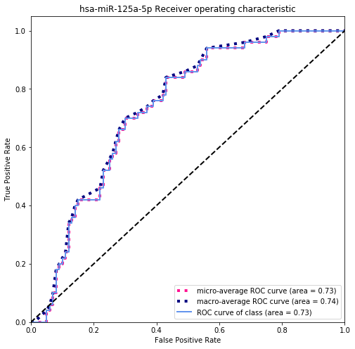
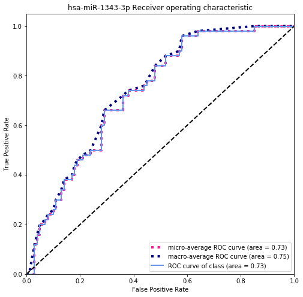
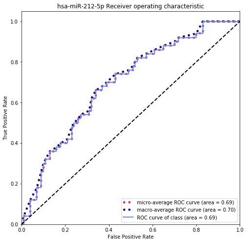
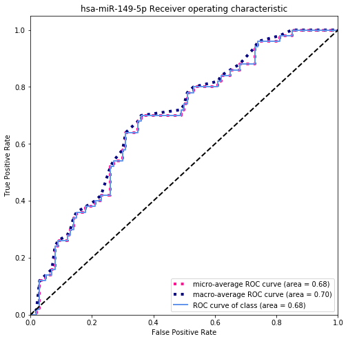
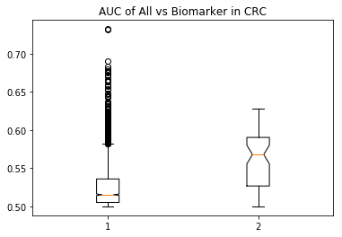

## Load modules.
```python
#Import module
import numpy as np
import matplotlib.pyplot as plt
import pandas as pd
from itertools import cycle

from sklearn import svm, datasets
from sklearn.metrics import roc_curve, auc
from sklearn.model_selection import train_test_split
from sklearn.preprocessing import label_binarize
from sklearn.multiclass import OneVsRestClassifier
from scipy import interp
```

## Read gene count table
```python
data=pd.read_csv('../diff-cancer/machine-classifer/transcript_mirna.txt',sep="\t")
label=pd.read_csv('../diff-cancer/machine-classifer/sample_classes.txt',sep="\t")

print(type(data))
print(data.head())
print(type(label))
print(label.head())
```

```sh
<class 'pandas.core.frame.DataFrame'>
                                             feature  Sample_1S3  Sample_1S6  \
0  hsa-let-7a-2-3p|miRNA|hsa-let-7a-2-3p|hsa-let-...           9          14   
1  hsa-let-7a-3p|miRNA|hsa-let-7a-3p|hsa-let-7a-3...         283         503   
2  hsa-let-7a-5p|miRNA|hsa-let-7a-5p|hsa-let-7a-5...        2460        6617   
3  hsa-let-7b-3p|miRNA|hsa-let-7b-3p|hsa-let-7b-3...         230         340   
4  hsa-let-7b-5p|miRNA|hsa-let-7b-5p|hsa-let-7b-5...       56569       55954   

   Sample_1S9  Sample_1S12  Sample_1S15  Sample_1S18  Sample_1S21  \
0           3            1            6            1            6   
1         214          153          451          165          435   
2        2140         1718         3872         1757         4559   
3         147          219          207          122          189   
4       51215        55669        23908        25192        32174   

   Sample_1S24  Sample_4S2     ...       Sample_4S16  Sample_4S19  \
0            8          14     ...                18            3   
1          564         659     ...               733          185   
2         6526        6476     ...             11828         1815   
3          278         335     ...               504          174   
4        58741       53344     ...             63867        37678   

   Sample_4S22  Sample_4S25  Sample_N49  Sample_Pan05  Sample_Pan06  \
0            6            5          11             1             1   
1          224          685         837           186           166   
2         2512         6301        7514          1539          1457   
3          278          308         367           124           128   
4        43107        37548       61921         16446         16151   

   Sample_PC6  Sample_PC12  Sample_PC26  
0           7           12           10  
1         294          647          498  
2        2386         5836         4888  
3         265          395          219  
4       59529        59295        57452  

[5 rows x 193 columns]
<class 'pandas.core.frame.DataFrame'>
     sample_id                      label
0   Sample_1S3  Colorectal Cancer Stage 1
1   Sample_1S6  Colorectal Cancer Stage 1
2   Sample_1S9  Colorectal Cancer Stage 1
3  Sample_1S12  Colorectal Cancer Stage 1
4  Sample_1S15  Colorectal Cancer Stage 1
```

```python
#data.iloc[0,0]
d1=data.loc[data['feature']=='hsa-let-7a-2-3p|miRNA|hsa-let-7a-2-3p|hsa-let-7a-2-3p|hsa-let-7a-2-3p|0|22']
d2=label.iloc[:,1].values
d2_unique=np.unique(d2)

#type(d2)
#print(d2)
print(d2_unique)
```
```sh
['Colorectal Cancer Stage 1' 'Colorectal Cancer Stage 2'
 'Colorectal Cancer Stage 3' 'Colorectal Cancer Stage 4' 'Healthy Control'
 'Pancreatic Cancer' 'Prostate Cancer']
 ```
## Normolize by sample with CPM
```python
#get dataframe shape
shape=data.shape

#divide gene counts and gene name
data_without_gene=data.iloc[:,1:shape[1]-1]
data_name=data.iloc[:,0]

#
#data_without_gene
#Sum each columns.
data_without_gene_sum=data_without_gene.sum()

#Calculate scale factor with cpm.
data_without_gene_sum_scale=data_without_gene_sum/1000000
data_without_gene_sum_scale=data_without_gene_sum_scale.values
data_without_gene_sum_scale

#Normolization gene counts with scale factor
data_without_gene_norm=data_without_gene/data_without_gene_sum_scale

#merge data frame
data_without_gene_norm_complete=pd.concat([data_name,data_without_gene_norm],axis=1)
data_without_gene_norm_complete.head()

```
```sh
feature	Sample_1S3	Sample_1S6	Sample_1S9	Sample_1S12	Sample_1S15	Sample_1S18	Sample_1S21	Sample_1S24	Sample_4S2	...	Sample_4S13	Sample_4S16	Sample_4S19	Sample_4S22	Sample_4S25	Sample_N49	Sample_Pan05	Sample_Pan06	Sample_PC6	Sample_PC12
0	hsa-let-7a-2-3p|miRNA|hsa-let-7a-2-3p|hsa-let-...	3.345375	5.742650	1.318290	0.335680	3.976786	0.592745	3.334663	2.801259	5.571423	...	2.968337	4.713108	1.153527	2.501790	2.144001	3.977516	0.984505	1.042936	2.230764	4.203083
1	hsa-let-7a-3p|miRNA|hsa-let-7a-3p|hsa-let-7a-3...	105.193472	206.325201	94.038033	51.358965	298.921761	97.802931	241.763103	197.488742	262.254842	...	325.032874	191.928227	71.134175	93.400153	293.728070	302.652822	183.117907	173.127305	93.692070	226.616234
2	hsa-let-7a-5p|miRNA|hsa-let-7a-5p|hsa-let-7a-5...	914.402622	2714.222369	940.380327	576.697397	2566.352677	1041.453031	2533.788478	2285.126822	2577.181123	...	2377.143015	3097.035560	697.883931	1047.416006	2701.869440	2717.005147	1515.153007	1519.557128	760.371696	2044.099449
3	hsa-let-7b-3p|miRNA|hsa-let-7b-3p|hsa-let-7b-3...	85.492928	139.464350	64.596219	73.513813	137.199123	72.314895	105.041900	97.343741	133.316195	...	129.617371	131.967021	66.904575	115.916262	132.070431	132.704404	122.078605	133.495753	84.450335	138.351488
4	hsa-let-7b-5p|miRNA|hsa-let-7b-5p|hsa-let-7b-5...	21027.171511	22951.730158	22505.410483	18686.942604	15846.167306	14932.432993	17881.577207	20568.592497	21228.713682	...	14704.645546	16722.892298	14487.532102	17974.108977	16100.586213	22390.161795	16191.167219	16844.452417	18970.732063	20768.484722
5 rows × 192 columns
```
## Label and Counts
```python
# Get label class.
label_class=label['label'].unique()
##print(label_class)

#Get healty class
label_healty=label.loc[label['label']=='Healthy Control']
healty=label_healty.iloc[:,0].values
healty2=np.append(['feature'],healty)
##print(healty)

#Get Colorectal cancer
label_colorectal_boolen=(label['label']=='Colorectal Cancer Stage 1' ) | (label['label']=='Colorectal Cancer Stage 2')| (label['label']=='Colorectal Cancer Stage 3')| (label['label']=='Colorectal Cancer Stage 4')
label_colorectal=label.loc[label_colorectal_boolen]
##print(label_colorectal)
colorectal=label_colorectal.iloc[:,0].values
colorectal2=np.append(['feature'],colorectal)
#print(colorectal)

#Get Prostate
label_prostate=label.loc[label['label']=='Prostate Cancer']
##print(label_prostate)
prostate=label_prostate.iloc[:,0].values
prostate2=np.append(['feature'],prostate)

#Get Pancreatic
label_pancreatic=label.loc[label['label']=='Pancreatic Cancer']
##print(label_pancreatic)
##type(label_pancreatic)
pancreatic=label_pancreatic.iloc[:,0].values
pancreatic2=np.append(['feature'],pancreatic)

type(pancreatic2)
print(pancreatic2)

```

```sh
['feature' 'Sample_Pan01' 'Sample_Pan02' 'Sample_Pan03' 'Sample_Pan04'
 'Sample_Pan05' 'Sample_Pan06']
```
## Generate arrays: expression and label.
```python
healty_count=data_without_gene_norm_complete[healty2]
colorectal_count=data_without_gene_norm_complete[colorectal2]
##
## There is not have Sample_PC26, so remove it.
prostate_count=data_without_gene_norm_complete[prostate2[0:36]]
pancreatic_count=data_without_gene_norm_complete[pancreatic2]

print(pancreatic_count)
```
```sh
                                               feature   Sample_Pan01  \
0     hsa-let-7a-2-3p|miRNA|hsa-let-7a-2-3p|hsa-let-...       3.231474   
1     hsa-let-7a-3p|miRNA|hsa-let-7a-3p|hsa-let-7a-3...     204.660000   
2     hsa-let-7a-5p|miRNA|hsa-let-7a-5p|hsa-let-7a-5...    1868.868952   
3     hsa-let-7b-3p|miRNA|hsa-let-7b-3p|hsa-let-7b-3...     145.416316   
4     hsa-let-7b-5p|miRNA|hsa-let-7b-5p|hsa-let-7b-5...   15746.971301   
5     hsa-let-7c-3p|miRNA|hsa-let-7c-3p|hsa-let-7c-3...      19.388842   
6     hsa-let-7c-5p|miRNA|hsa-let-7c-5p|hsa-let-7c-5...    1509.098214   
7     hsa-let-7d-3p|miRNA|hsa-let-7d-3p|hsa-let-7d-3...    1090.083792   
8     hsa-let-7d-5p|miRNA|hsa-let-7d-5p|hsa-let-7d-5...     618.288633   
9     hsa-let-7e-3p|miRNA|hsa-let-7e-3p|hsa-let-7e-3...      65.706632   
10    hsa-let-7e-5p|miRNA|hsa-let-7e-5p|hsa-let-7e-5...     310.221474   
11    hsa-let-7f-1-3p|miRNA|hsa-let-7f-1-3p|hsa-let-...      33.391895   
12    hsa-let-7f-2-3p|miRNA|hsa-let-7f-2-3p|hsa-let-...      51.703579   
13    hsa-let-7f-5p|miRNA|hsa-let-7f-5p|hsa-let-7f-5...     920.970002   
14    hsa-let-7g-3p|miRNA|hsa-let-7g-3p|hsa-let-7g-3...      11.848737   
15    hsa-let-7g-5p|miRNA|hsa-let-7g-5p|hsa-let-7g-5...    4687.791169   
16    hsa-let-7i-3p|miRNA|hsa-let-7i-3p|hsa-let-7i-3...     219.740211   
17    hsa-let-7i-5p|miRNA|hsa-let-7i-5p|hsa-let-7i-5...   33816.295029   
18    hsa-miR-1-3p|miRNA|hsa-miR-1-3p|hsa-miR-1-3p|h...      37.700526   
19    hsa-miR-1-5p|miRNA|hsa-miR-1-5p|hsa-miR-1-5p|h...       0.000000   
20    hsa-miR-100-3p|miRNA|hsa-miR-100-3p|hsa-miR-10...       0.000000   
21    hsa-miR-100-5p|miRNA|hsa-miR-100-5p|hsa-miR-10...   37247.042932   
22    hsa-miR-101-2-5p|miRNA|hsa-miR-101-2-5p|hsa-mi...       0.000000   
23    hsa-miR-101-3p|miRNA|hsa-miR-101-3p|hsa-miR-10...   21101.523209   
24    hsa-miR-101-5p|miRNA|hsa-miR-101-5p|hsa-miR-10...       1.077158   
25    hsa-miR-10226|miRNA|hsa-miR-10226|hsa-miR-1022...       0.000000   
26    hsa-miR-10392-3p|miRNA|hsa-miR-10392-3p|hsa-mi...       0.000000   
27    hsa-miR-10392-5p|miRNA|hsa-miR-10392-5p|hsa-mi...       0.000000   
28    hsa-miR-10393-3p|miRNA|hsa-miR-10393-3p|hsa-mi...       0.000000   
29    hsa-miR-10393-5p|miRNA|hsa-miR-10393-5p|hsa-mi...       0.000000   
...                                                 ...            ...   
2361  hsa-miR-939-3p|miRNA|hsa-miR-939-3p|hsa-miR-93...       0.000000   
2362  hsa-miR-939-5p|miRNA|hsa-miR-939-5p|hsa-miR-93...       0.000000   
2363  hsa-miR-940|miRNA|hsa-miR-940|hsa-miR-940|hsa-...       0.000000   
2364  hsa-miR-941|miRNA|hsa-miR-941|hsa-miR-941|hsa-...       5.385789   
2365  hsa-miR-942-3p|miRNA|hsa-miR-942-3p|hsa-miR-94...       1.077158   
2366  hsa-miR-942-5p|miRNA|hsa-miR-942-5p|hsa-miR-94...       0.000000   
2367  hsa-miR-943|miRNA|hsa-miR-943|hsa-miR-943|hsa-...       0.000000   
2368  hsa-miR-944|miRNA|hsa-miR-944|hsa-miR-944|hsa-...       1.077158   
2369  hsa-miR-95-3p|miRNA|hsa-miR-95-3p|hsa-miR-95-3...       2.154316   
2370  hsa-miR-95-5p|miRNA|hsa-miR-95-5p|hsa-miR-95-5...       0.000000   
2371  hsa-miR-9500|miRNA|hsa-miR-9500|hsa-miR-9500|h...       0.000000   
2372  hsa-miR-96-3p|miRNA|hsa-miR-96-3p|hsa-miR-96-3...       0.000000   
2373  hsa-miR-96-5p|miRNA|hsa-miR-96-5p|hsa-miR-96-5...       2.154316   
2374  hsa-miR-9718|miRNA|hsa-miR-9718|hsa-miR-9718|h...       0.000000   
2375  hsa-miR-98-3p|miRNA|hsa-miR-98-3p|hsa-miR-98-3...      24.774632   
2376  hsa-miR-98-5p|miRNA|hsa-miR-98-5p|hsa-miR-98-5...     152.956421   
2377  hsa-miR-9851-3p|miRNA|hsa-miR-9851-3p|hsa-miR-...      10.771579   
2378  hsa-miR-9851-5p|miRNA|hsa-miR-9851-5p|hsa-miR-...       0.000000   
2379  hsa-miR-9899|miRNA|hsa-miR-9899|hsa-miR-9899|h...       1.077158   
2380  hsa-miR-9900|miRNA|hsa-miR-9900|hsa-miR-9900|h...       0.000000   
2381  hsa-miR-9901|miRNA|hsa-miR-9901|hsa-miR-9901|h...       1.077158   
2382  hsa-miR-9902|miRNA|hsa-miR-9902|hsa-miR-9902|h...       0.000000   
2383  hsa-miR-9903|miRNA|hsa-miR-9903|hsa-miR-9903|h...       0.000000   
2384  hsa-miR-9983-3p|miRNA|hsa-miR-9983-3p|hsa-miR-...       0.000000   
2385  hsa-miR-9985|miRNA|hsa-miR-9985|hsa-miR-9985|h...      25.851790   
2386  hsa-miR-9986|miRNA|hsa-miR-9986|hsa-miR-9986|h...       0.000000   
2387  hsa-miR-99a-3p|miRNA|hsa-miR-99a-3p|hsa-miR-99...      21.543158   
2388  hsa-miR-99a-5p|miRNA|hsa-miR-99a-5p|hsa-miR-99...  146573.183723   
2389  hsa-miR-99b-3p|miRNA|hsa-miR-99b-3p|hsa-miR-99...     439.480422   
2390  hsa-miR-99b-5p|miRNA|hsa-miR-99b-5p|hsa-miR-99...   13131.631927   

       Sample_Pan02   Sample_Pan03   Sample_Pan04   Sample_Pan05  \
0          0.000000       2.615656       2.047139       0.984505   
1        196.960982     136.014090      98.262695     183.117907   
2       1789.435282    1166.582384     870.034279    1515.153007   
3        165.626280     137.757860     119.757660     122.078605   
4      16511.149558   18497.044309   14572.562394   16191.167219   
5         14.548254      18.309589      13.306407      10.829554   
6       1430.205309    1382.809912     850.586454    1266.073273   
7       1144.835705     889.322894     685.791726     971.706314   
8        536.047217     410.657925     360.296549     561.167780   
9         49.240245      38.362948      35.824941      45.287224   
10       330.133463     259.821787     213.926076     279.599385   
11        42.525666      28.772211      16.377116      33.473166   
12        47.002052      40.978604      42.989929      32.488661   
13       933.326470     567.597259     396.121490     805.324990   
14        17.905544      11.334507      14.329976       9.845049   
15      4112.679587    3168.430781    2425.860285    3263.633670   
16       219.342911     235.409001     227.232482     217.575578   
17     29930.235525   33584.145640   30563.792449   30156.368910   
18        36.930184      28.772211      21.494965      19.690098   
19         0.000000       0.000000       0.000000       0.000000   
20         0.000000       0.000000       0.000000       0.000000   
21     35441.785720   38155.439692   40132.122382   38166.300595   
22         0.000000       0.000000       0.000000       0.000000   
23     17434.404159   17611.208956   18439.608874   18520.505760   
24         1.119096       4.359426       1.023570       0.000000   
25         0.000000       0.000000       0.000000       0.000000   
26         0.000000       0.000000       0.000000       0.000000   
27         0.000000       0.000000       0.000000       0.000000   
28         0.000000       0.000000       0.000000       0.000000   
29         0.000000       0.000000       0.000000       0.000000   
...             ...            ...            ...            ...   
2361       0.000000       0.000000       0.000000       0.000000   
2362       0.000000       0.000000       0.000000       0.000000   
2363       0.000000       0.000000       0.000000       0.984505   
2364       3.357289       3.487541       4.094279       0.984505   
2365       0.000000       0.000000       0.000000       0.000000   
2366       1.119096       0.000000       0.000000       2.953515   
2367       0.000000       0.000000       0.000000       0.000000   
2368       0.000000       0.871885       0.000000       0.000000   
2369       2.238193       0.871885       1.023570       0.000000   
2370       1.119096       0.000000       0.000000       0.984505   
2371       0.000000       0.000000       0.000000       0.000000   
2372       0.000000       0.000000       0.000000       0.000000   
2373       3.357289       5.231311       4.094279       2.953515   
2374       0.000000       0.000000       0.000000       0.000000   
2375      31.334702      17.437704      16.377116      21.659107   
2376     152.197122     121.192041      66.532033     124.047615   
2377      10.071868       9.590737       6.141418       4.922524   
2378       1.119096       0.000000       0.000000       0.000000   
2379       0.000000       0.000000       0.000000       0.000000   
2380       0.000000       0.000000       0.000000       0.000000   
2381       0.000000       0.000000       0.000000       0.000000   
2382       0.000000       0.000000       0.000000       0.000000   
2383       0.000000       0.000000       0.000000       0.000000   
2384       0.000000       0.871885       1.023570       1.969010   
2385       2.238193       6.103196       3.070709       0.984505   
2386       0.000000       0.000000       0.000000       0.000000   
2387      27.977412      21.797130      16.377116      17.721088   
2388  154729.637480  148387.012398  153383.972740  155550.786176   
2389     442.043112     490.871362     499.502033     446.965214   
2390   12930.040802   12949.238844   13061.773457   13135.264079   

       Sample_Pan06  
0          1.042936  
1        173.127305  
2       1519.557128  
3        133.495753  
4      16844.452417  
5         18.772840  
6       1511.213643  
7        984.531180  
8        523.553657  
9         51.103843  
10       265.948571  
11        38.588616  
12        46.932101  
13       796.802777  
14        13.558162  
15      4344.869591  
16       210.672985  
17     32369.591336  
18        32.331003  
19         0.000000  
20         0.000000  
21     38806.589684  
22         0.000000  
23     18249.286632  
24         2.085871  
25         0.000000  
26         0.000000  
27         0.000000  
28         0.000000  
29         0.000000  
...             ...  
2361       0.000000  
2362       0.000000  
2363       0.000000  
2364       1.042936  
2365       0.000000  
2366       1.042936  
2367       0.000000  
2368       2.085871  
2369       1.042936  
2370       0.000000  
2371       0.000000  
2372       0.000000  
2373       0.000000  
2374       0.000000  
2375      23.987518  
2376     134.538689  
2377       7.300549  
2378       0.000000  
2379       0.000000  
2380       0.000000  
2381       0.000000  
2382       0.000000  
2383       0.000000  
2384       2.085871  
2385       5.214678  
2386       0.000000  
2387      28.159260  
2388  146611.710915  
2389     519.381915  
2390   13455.954745  

[2391 rows x 7 columns]

```
## Select one gene to plot auc.
```python
gene_name='hsa-let-7a-3p|miRNA|hsa-let-7a-3p|hsa-let-7a-3p|hsa-let-7a-3p|0|21'
roc_calcualte(gene_name)
```
```sh
0.5966
```
```python
def roc_calcualte_plot(gene_name):
    #Select biomarker by gene name.
    global healty_count
    global colorectal_count
    global control_label
    global cancer_label
    
    control=healty_count.loc[healty_count['feature']==gene_name]
    cancer=colorectal_count.loc[colorectal_count['feature']==gene_name]

    #Remove the name
    control2=control.iloc[:,1:control.shape[1]].values
    cancer2=cancer.iloc[:,1:cancer.shape[1]].values
    Expression2=np.append(control2[0],cancer2[0])

    #set class label
    control_label=np.repeat(0,control2[0].shape)
    cancer_label=np.repeat(1,cancer2[0].shape)

    #merge label
    Label2=np.append(control_label,cancer_label)

    #input data
    Expression=np.asarray(Expression2)
    Label=np.asarray(Label2)

    # set dictory
    Fpr = dict()
    Tpr = dict()
    Roc_auc = dict()

    #calculate FPR, TPR and ROC
    Fpr[0], Tpr[0], _= roc_curve(Label, Expression)
    Roc_auc[0] = auc(Fpr[0], Tpr[0])

    #Calculate micro-FPR, micro-TPR and micro-AUC
    Fpr["micro"], Tpr["micro"], _ = roc_curve(Label.ravel(), Expression.ravel())
    Roc_auc["micro"] = auc(Fpr["micro"], Tpr["micro"])

    # Compute macro-average ROC curve and ROC area


    # First aggregate all false positive rates
    All_Fpr = np.unique(Fpr[0])


    # Then interpolate all ROC curves at this points
    mean_Tpr = np.zeros_like(All_Fpr)
    mean_Tpr += interp(All_Fpr, Fpr[0], Tpr[0])


    # Finally average it and compute AUC

    Fpr["macro"] = All_Fpr
    Tpr["macro"] = mean_Tpr
    Roc_auc["macro"] = auc(Fpr["macro"], Tpr["macro"])

    if(Roc_auc[0]<0.5):
        control_label=np.repeat(1,control2[0].shape)
        cancer_label=np.repeat(0,cancer2[0].shape)
        Label2=np.append(control_label,cancer_label)
        Label=np.asarray(Label2)
        # set dictory
        Fpr = dict()
        Tpr = dict()
        Roc_auc = dict()
        #calculate FPR, TPR and ROC
        Fpr[0], Tpr[0], _= roc_curve(Label, Expression)
        Roc_auc[0] = auc(Fpr[0], Tpr[0])
        #Calculate micro-FPR, micro-TPR and micro-AUC
        Fpr["micro"], Tpr["micro"], _ = roc_curve(Label.ravel(), Expression.ravel())
        Roc_auc["micro"] = auc(Fpr["micro"], Tpr["micro"])
        # Compute macro-average ROC curve and ROC area
        # First aggregate all false positive rates
        All_Fpr = np.unique(Fpr[0])
        # Then interpolate all ROC curves at this points
        mean_Tpr = np.zeros_like(All_Fpr)
        mean_Tpr += interp(All_Fpr, Fpr[0], Tpr[0])
        # Finally average it and compute AUC
        Fpr["macro"] = All_Fpr
        Tpr["macro"] = mean_Tpr
        Roc_auc["macro"] = auc(Fpr["macro"], Tpr["macro"])
        
    names_plt=gene_name.split('|')

    # Plot all ROC curves
    color='cornflowerblue'
    lw=2
    plt.figure(figsize=(8, 8))
    plt.plot(Fpr["micro"], Tpr["micro"],
             label='micro-average ROC curve (area = {0:0.2f})'
                   ''.format(Roc_auc["micro"]),
             color='deeppink', linestyle=':', linewidth=4)

    plt.plot(Fpr["macro"], Tpr["macro"],
             label='macro-average ROC curve (area = {0:0.2f})'
                   ''.format(Roc_auc["macro"]),
             color='navy', linestyle=':', linewidth=4)

    colors = cycle(['aqua', 'darkorange', 'cornflowerblue'])


    plt.plot(Fpr[0], Tpr[0], color=color, lw=lw,
        label='ROC curve of class (area = {1:0.2f})'
        ''.format(0, Roc_auc[0]))

    plt.plot([0, 1], [0, 1], 'k--', lw=lw)
    plt.xlim([0.0, 1.0])
    plt.ylim([0.0, 1.05])
    plt.xlabel('False Positive Rate')
    plt.ylabel('True Positive Rate')
    plt.title(names_plt[0]+' Receiver operating characteristic')
    plt.legend(loc="lower right")
    plt.show()
```
```python
def roc_calcualte(gene_name):
    #Select biomarker by gene name.
    control=healty_count.loc[healty_count['feature']==gene_name]
    cancer=colorectal_count.loc[colorectal_count['feature']==gene_name]

    #Remove the name
    control2=control.iloc[:,1:control.shape[1]].values
    cancer2=cancer.iloc[:,1:cancer.shape[1]].values
    Expression2=np.append(control2[0],cancer2[0])

    #set class label
    control_label=np.repeat(0,control2[0].shape)
    cancer_label=np.repeat(1,cancer2[0].shape)

    #merge label
    Label2=np.append(control_label,cancer_label)

    #input data
    Expression=np.asarray(Expression2)
    Label=np.asarray(Label2)

    # set dictory
    Fpr = dict()
    Tpr = dict()
    Roc_auc = dict()

    #calculate FPR, TPR and ROC
    Fpr[0], Tpr[0], _= roc_curve(Label, Expression)
    Roc_auc[0] = auc(Fpr[0], Tpr[0])

    #Calculate micro-FPR, micro-TPR and micro-AUC
    Fpr["micro"], Tpr["micro"], _ = roc_curve(Label.ravel(), Expression.ravel())
    Roc_auc["micro"] = auc(Fpr["micro"], Tpr["micro"])

    # Compute macro-average ROC curve and ROC area


    # First aggregate all false positive rates
    All_Fpr = np.unique(Fpr[0])


    # Then interpolate all ROC curves at this points
    mean_Tpr = np.zeros_like(All_Fpr)
    mean_Tpr += interp(All_Fpr, Fpr[0], Tpr[0])


    # Finally average it and compute AUC

    Fpr["macro"] = All_Fpr
    Tpr["macro"] = mean_Tpr
    Roc_auc["macro"] = auc(Fpr["macro"], Tpr["macro"])

    if(Roc_auc[0]<0.5):
        control_label=np.repeat(1,control2[0].shape)
        cancer_label=np.repeat(0,cancer2[0].shape)
        Label2=np.append(control_label,cancer_label)
        Label=np.asarray(Label2)
        # set dictory
        Fpr = dict()
        Tpr = dict()
        Roc_auc = dict()
        #calculate FPR, TPR and ROC
        Fpr[0], Tpr[0], _= roc_curve(Label, Expression)
        Roc_auc[0] = auc(Fpr[0], Tpr[0])
        #Calculate micro-FPR, micro-TPR and micro-AUC
        Fpr["micro"], Tpr["micro"], _ = roc_curve(Label.ravel(), Expression.ravel())
        Roc_auc["micro"] = auc(Fpr["micro"], Tpr["micro"])
        # Compute macro-average ROC curve and ROC area
        # First aggregate all false positive rates
        All_Fpr = np.unique(Fpr[0])
        # Then interpolate all ROC curves at this points
        mean_Tpr = np.zeros_like(All_Fpr)
        mean_Tpr += interp(All_Fpr, Fpr[0], Tpr[0])
        # Finally average it and compute AUC
        Fpr["macro"] = All_Fpr
        Tpr["macro"] = mean_Tpr
        Roc_auc["macro"] = auc(Fpr["macro"], Tpr["macro"])
    return Roc_auc[0]
```
```python
def roc_calcualte_all(gene_name):
    #Select biomarker by gene name.
    control=healty_count.loc[healty_count['feature']==gene_name]
    cancer=colorectal_count.loc[colorectal_count['feature']==gene_name]

    #Remove the name
    control2=control.iloc[:,1:control.shape[1]].values
    cancer2=cancer.iloc[:,1:cancer.shape[1]].values
    Expression2=np.append(control2[0],cancer2[0])

    #set class label
    control_label=np.repeat(0,control2[0].shape)
    cancer_label=np.repeat(1,cancer2[0].shape)

    #merge label
    Label2=np.append(control_label,cancer_label)

    #input data
    Expression=np.asarray(Expression2)
    Label=np.asarray(Label2)

    # set dictory
    Fpr = dict()
    Tpr = dict()
    Roc_auc = dict()

    #calculate FPR, TPR and ROC
    Fpr[0], Tpr[0], _= roc_curve(Label, Expression)
    Roc_auc[0] = auc(Fpr[0], Tpr[0])

    #Calculate micro-FPR, micro-TPR and micro-AUC
    Fpr["micro"], Tpr["micro"], _ = roc_curve(Label.ravel(), Expression.ravel())
    Roc_auc["micro"] = auc(Fpr["micro"], Tpr["micro"])

    # Compute macro-average ROC curve and ROC area


    # First aggregate all false positive rates
    All_Fpr = np.unique(Fpr[0])


    # Then interpolate all ROC curves at this points
    mean_Tpr = np.zeros_like(All_Fpr)
    mean_Tpr += interp(All_Fpr, Fpr[0], Tpr[0])


    # Finally average it and compute AUC

    Fpr["macro"] = All_Fpr
    Tpr["macro"] = mean_Tpr
    Roc_auc["macro"] = auc(Fpr["macro"], Tpr["macro"])

    if(Roc_auc[0]<0.5):
        control_label=np.repeat(1,control2[0].shape)
        cancer_label=np.repeat(0,cancer2[0].shape)
        Label2=np.append(control_label,cancer_label)
        Label=np.asarray(Label2)
        # set dictory
        Fpr = dict()
        Tpr = dict()
        Roc_auc = dict()
        #calculate FPR, TPR and ROC
        Fpr[0], Tpr[0], _= roc_curve(Label, Expression)
        Roc_auc[0] = auc(Fpr[0], Tpr[0])
        #Calculate micro-FPR, micro-TPR and micro-AUC
        Fpr["micro"], Tpr["micro"], _ = roc_curve(Label.ravel(), Expression.ravel())
        Roc_auc["micro"] = auc(Fpr["micro"], Tpr["micro"])
        # Compute macro-average ROC curve and ROC area
        # First aggregate all false positive rates
        All_Fpr = np.unique(Fpr[0])
        # Then interpolate all ROC curves at this points
        mean_Tpr = np.zeros_like(All_Fpr)
        mean_Tpr += interp(All_Fpr, Fpr[0], Tpr[0])
        # Finally average it and compute AUC
        Fpr["macro"] = All_Fpr
        Tpr["macro"] = mean_Tpr
        Roc_auc["macro"] = auc(Fpr["macro"], Tpr["macro"])
    return [ [Roc_auc[0], Fpr[0], Tpr[0]], [ Roc_auc["micro"], Fpr["micro"], Tpr["micro"]],[Roc_auc["macro"],Fpr["macro"],Tpr["macro"]] ]

```
```python
names=data_without_gene_norm_complete.iloc[:,0]
#print(names)
values={}

for x in names:
    #print(x)
    value=roc_calcualte(x)
    values[x]=value
values_sorted=sorted(values.items(), key=lambda x: x[1],reverse=True)
values_table=pd.DataFrame.from_dict(values_sorted)

print(values_table)
values_table.to_csv('healty_vs_CRC.csv',  encoding='utf-8')

```
```sh
0     hsa-miR-125a-5p|miRNA|hsa-miR-125a-5p|hsa-miR-...  0.7324
1     hsa-miR-1343-3p|miRNA|hsa-miR-1343-3p|hsa-miR-...  0.7312
2     hsa-miR-212-5p|miRNA|hsa-miR-212-5p|hsa-miR-21...  0.6902
3     hsa-miR-149-5p|miRNA|hsa-miR-149-5p|hsa-miR-14...  0.6830
4     hsa-miR-543|miRNA|hsa-miR-543|hsa-miR-543|hsa-...  0.6794
5     hsa-miR-128-3p|miRNA|hsa-miR-128-3p|hsa-miR-12...  0.6776
6     hsa-miR-935|miRNA|hsa-miR-935|hsa-miR-935|hsa-...  0.6762
7     hsa-miR-181b-2-3p|miRNA|hsa-miR-181b-2-3p|hsa-...  0.6746
8     hsa-miR-191-3p|miRNA|hsa-miR-191-3p|hsa-miR-19...  0.6720
9     hsa-miR-455-5p|miRNA|hsa-miR-455-5p|hsa-miR-45...  0.6720
10    hsa-miR-346|miRNA|hsa-miR-346|hsa-miR-346|hsa-...  0.6700
11    hsa-miR-30a-3p|miRNA|hsa-miR-30a-3p|hsa-miR-30...  0.6658
12    hsa-miR-411-3p|miRNA|hsa-miR-411-3p|hsa-miR-41...  0.6652
13    hsa-miR-28-3p|miRNA|hsa-miR-28-3p|hsa-miR-28-3...  0.6642
14    hsa-miR-744-3p|miRNA|hsa-miR-744-3p|hsa-miR-74...  0.6628
15    hsa-miR-28-5p|miRNA|hsa-miR-28-5p|hsa-miR-28-5...  0.6588
16    hsa-miR-708-5p|miRNA|hsa-miR-708-5p|hsa-miR-70...  0.6582
17    hsa-miR-514b-3p|miRNA|hsa-miR-514b-3p|hsa-miR-...  0.6572
18    hsa-miR-92b-3p|miRNA|hsa-miR-92b-3p|hsa-miR-92...  0.6536
19    hsa-miR-139-5p|miRNA|hsa-miR-139-5p|hsa-miR-13...  0.6524
20    hsa-miR-130b-3p|miRNA|hsa-miR-130b-3p|hsa-miR-...  0.6480
21    hsa-miR-876-3p|miRNA|hsa-miR-876-3p|hsa-miR-87...  0.6470
22    hsa-miR-409-3p|miRNA|hsa-miR-409-3p|hsa-miR-40...  0.6450
23    hsa-miR-221-5p|miRNA|hsa-miR-221-5p|hsa-miR-22...  0.6448
24    hsa-miR-376a-3p|miRNA|hsa-miR-376a-3p|hsa-miR-...  0.6428
25    hsa-miR-514a-3p|miRNA|hsa-miR-514a-3p|hsa-miR-...  0.6428
26    hsa-miR-615-3p|miRNA|hsa-miR-615-3p|hsa-miR-61...  0.6374
27    hsa-miR-210-3p|miRNA|hsa-miR-210-3p|hsa-miR-21...  0.6360
28    hsa-miR-30e-3p|miRNA|hsa-miR-30e-3p|hsa-miR-30...  0.6352
29    hsa-miR-490-5p|miRNA|hsa-miR-490-5p|hsa-miR-49...  0.6338
...                                                 ...     ...
2361  hsa-miR-514a-5p|miRNA|hsa-miR-514a-5p|hsa-miR-...  0.5000
2362  hsa-miR-515-3p|miRNA|hsa-miR-515-3p|hsa-miR-51...  0.5000
2363  hsa-miR-5192|miRNA|hsa-miR-5192|hsa-miR-5192|h...  0.5000
2364  hsa-miR-520e-5p|miRNA|hsa-miR-520e-5p|hsa-miR-...  0.5000
2365  hsa-miR-520g-3p|miRNA|hsa-miR-520g-3p|hsa-miR-...  0.5000
2366  hsa-miR-525-5p|miRNA|hsa-miR-525-5p|hsa-miR-52...  0.5000
2367  hsa-miR-526b-3p|miRNA|hsa-miR-526b-3p|hsa-miR-...  0.5000
2368  hsa-miR-548a-5p|miRNA|hsa-miR-548a-5p|hsa-miR-...  0.5000
2369  hsa-miR-548c-5p|miRNA|hsa-miR-548c-5p|hsa-miR-...  0.5000
2370  hsa-miR-5591-5p|miRNA|hsa-miR-5591-5p|hsa-miR-...  0.5000
2371  hsa-miR-5693|miRNA|hsa-miR-5693|hsa-miR-5693|h...  0.5000
2372  hsa-miR-5700|miRNA|hsa-miR-5700|hsa-miR-5700|h...  0.5000
2373  hsa-miR-6074|miRNA|hsa-miR-6074|hsa-miR-6074|h...  0.5000
2374  hsa-miR-614|miRNA|hsa-miR-614|hsa-miR-614|hsa-...  0.5000
2375  hsa-miR-645|miRNA|hsa-miR-645|hsa-miR-645|hsa-...  0.5000
2376  hsa-miR-6731-3p|miRNA|hsa-miR-6731-3p|hsa-miR-...  0.5000
2377  hsa-miR-6732-5p|miRNA|hsa-miR-6732-5p|hsa-miR-...  0.5000
2378  hsa-miR-6739-3p|miRNA|hsa-miR-6739-3p|hsa-miR-...  0.5000
2379  hsa-miR-6763-3p|miRNA|hsa-miR-6763-3p|hsa-miR-...  0.5000
2380  hsa-miR-6769b-3p|miRNA|hsa-miR-6769b-3p|hsa-mi...  0.5000
2381  hsa-miR-6774-5p|miRNA|hsa-miR-6774-5p|hsa-miR-...  0.5000
2382  hsa-miR-6779-3p|miRNA|hsa-miR-6779-3p|hsa-miR-...  0.5000
2383  hsa-miR-6788-3p|miRNA|hsa-miR-6788-3p|hsa-miR-...  0.5000
2384  hsa-miR-6822-5p|miRNA|hsa-miR-6822-5p|hsa-miR-...  0.5000
2385  hsa-miR-6841-3p|miRNA|hsa-miR-6841-3p|hsa-miR-...  0.5000
2386  hsa-miR-6849-3p|miRNA|hsa-miR-6849-3p|hsa-miR-...  0.5000
2387  hsa-miR-6864-3p|miRNA|hsa-miR-6864-3p|hsa-miR-...  0.5000
2388  hsa-miR-7152-5p|miRNA|hsa-miR-7152-5p|hsa-miR-...  0.5000
2389  hsa-miR-877-3p|miRNA|hsa-miR-877-3p|hsa-miR-87...  0.5000
2390  hsa-miR-888-5p|miRNA|hsa-miR-888-5p|hsa-miR-88...  0.5000

[2391 rows x 2 columns]
```
```python
#print(values_table.iloc[1:11,])
for i in range(10):
    print(values_table.iloc[i,0],values_table.iloc[i,1])
```
```sh
hsa-miR-125a-5p|miRNA|hsa-miR-125a-5p|hsa-miR-125a-5p|hsa-miR-125a-5p|0|24 0.7323999999999999
hsa-miR-1343-3p|miRNA|hsa-miR-1343-3p|hsa-miR-1343-3p|hsa-miR-1343-3p|0|22 0.7312
hsa-miR-212-5p|miRNA|hsa-miR-212-5p|hsa-miR-212-5p|hsa-miR-212-5p|0|23 0.6902
hsa-miR-149-5p|miRNA|hsa-miR-149-5p|hsa-miR-149-5p|hsa-miR-149-5p|0|23 0.683
hsa-miR-543|miRNA|hsa-miR-543|hsa-miR-543|hsa-miR-543|0|22 0.6794
hsa-miR-128-3p|miRNA|hsa-miR-128-3p|hsa-miR-128-3p|hsa-miR-128-3p|0|21 0.6776
hsa-miR-935|miRNA|hsa-miR-935|hsa-miR-935|hsa-miR-935|0|23 0.6761999999999999
hsa-miR-181b-2-3p|miRNA|hsa-miR-181b-2-3p|hsa-miR-181b-2-3p|hsa-miR-181b-2-3p|0|20 0.6746000000000001
hsa-miR-191-3p|miRNA|hsa-miR-191-3p|hsa-miR-191-3p|hsa-miR-191-3p|0|22 0.672
hsa-miR-455-5p|miRNA|hsa-miR-455-5p|hsa-miR-455-5p|hsa-miR-455-5p|0|22 0.6719999999999999
```
```python
roc_calcualte_plot('hsa-miR-125a-5p|miRNA|hsa-miR-125a-5p|hsa-miR-125a-5p|hsa-miR-125a-5p|0|24')
```


```python
roc_calcualte_plot('hsa-miR-1343-3p|miRNA|hsa-miR-1343-3p|hsa-miR-1343-3p|hsa-miR-1343-3p|0|22')
```


```python
roc_calcualte_plot('hsa-miR-212-5p|miRNA|hsa-miR-212-5p|hsa-miR-212-5p|hsa-miR-212-5p|0|23')
```


```python
roc_calcualte_plot('hsa-miR-149-5p|miRNA|hsa-miR-149-5p|hsa-miR-149-5p|hsa-miR-149-5p|0|23')
```

## Read biomaker file
```python
biomarker=pd.read_table('tmp-data/biomaker-id-CRC-0219.txt',sep="\t")
biomarker_name=biomarker.iloc[:,2].values
#print(biomarker_name)
biomarker_name_array=[]
for i in biomarker_name:
    array=i.split(',')
    for j in array:
        biomarker_name_array.append(j)
        
#print(biomarker_name_array)  
```
### select biomaker 
```python
#print (values_table)
biomarker_auc=values_table.loc[values_table[0].isin(biomarker_name_array)]
biomarker_auc_values=biomarker_auc.iloc[:,1].values
all_auc_values=values_table.iloc[:,1].values

print(biomarker_auc_values,all_auc_values)
```
```sh
[0.6284 0.6226 0.6202 0.6188 0.6148 0.6132 0.611  0.6094 0.6078 0.601
 0.6008 0.5974 0.596  0.5958 0.5942 0.5936 0.5906 0.5896 0.588  0.5842
 0.5818 0.5816 0.58   0.5798 0.5774 0.5756 0.5752 0.5732 0.5728 0.5726
 0.5712 0.5708 0.568  0.5678 0.5652 0.565  0.565  0.5584 0.5556 0.5548
 0.5512 0.55   0.5482 0.5446 0.5428 0.5392 0.539  0.5334 0.5284 0.5262
 0.5234 0.5234 0.523  0.519  0.5184 0.518  0.516  0.5134 0.5112 0.5102
 0.5096 0.5096 0.5086 0.5074 0.5024 0.5004] [0.7324 0.7312 0.6902 ... 0.5    0.5    0.5   ]
 ```
 ```python
 data = [all_auc_values,biomarker_auc_values]

fig2, ax2 = plt.subplots()
ax2.set_title('AUC of All vs Biomarker in CRC')
ax2.boxplot(data, notch=True)
#plt.plot(all_auc_values,biomarker_auc_values, linewidth=1, color='k')
```
```sh
{'whiskers': [<matplotlib.lines.Line2D at 0x7f18cf3da160>,
  <matplotlib.lines.Line2D at 0x7f18cf59ef28>,
  <matplotlib.lines.Line2D at 0x7f18cf587390>,
  <matplotlib.lines.Line2D at 0x7f18cf587160>],
 'caps': [<matplotlib.lines.Line2D at 0x7f18cf59e588>,
  <matplotlib.lines.Line2D at 0x7f18cf59ec50>,
  <matplotlib.lines.Line2D at 0x7f18cf587710>,
  <matplotlib.lines.Line2D at 0x7f18cf1dd630>],
 'boxes': [<matplotlib.lines.Line2D at 0x7f18cf3da8d0>,
  <matplotlib.lines.Line2D at 0x7f18cf5872b0>],
 'medians': [<matplotlib.lines.Line2D at 0x7f18cf59ee48>,
  <matplotlib.lines.Line2D at 0x7f18cf4da908>],
 'fliers': [<matplotlib.lines.Line2D at 0x7f18cf5cf160>,
  <matplotlib.lines.Line2D at 0x7f18cf4da630>],
 'means': []}
 ```
 


